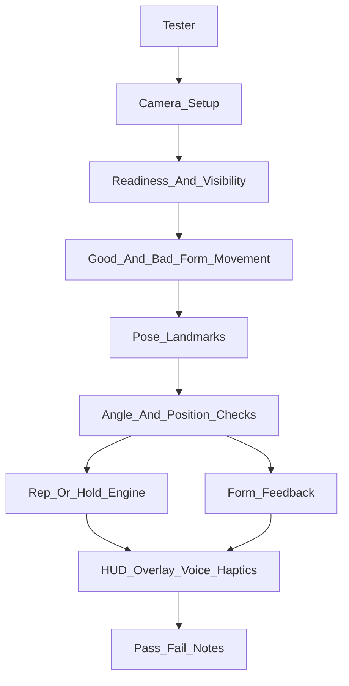

# End-to-End Manual Testing Plan

## Scope

This plan validates the upgraded exercise engine holistically across all currently available exercises in [VirtualTrainer/Models/ExerciseLibrary.swift](VirtualTrainer/Models/ExerciseLibrary.swift) and [VirtualTrainer/Models/WorkoutData.swift](VirtualTrainer/Models/WorkoutData.swift). It is designed for real-device camera testing because many regressions in MediaPipe pose tracking, overlays, side selection, and form cues cannot be judged from unit tests alone.

Core systems under test:

- [VirtualTrainer/Vision/PoseEstimator.swift](VirtualTrainer/Vision/PoseEstimator.swift): MediaPipe landmarks, world landmarks, segmentation, visibility.
- [VirtualTrainer/Vision/AngleCalculator.swift](VirtualTrainer/Vision/AngleCalculator.swift): 2D/3D angles, active side, positional checks.
- [VirtualTrainer/RepCounting/UniversalRepCounter.swift](VirtualTrainer/RepCounting/UniversalRepCounter.swift): rep phases, hold timing, form score, active-side telemetry.
- [VirtualTrainer/Coaching/FormFeedbackEngine.swift](VirtualTrainer/Coaching/FormFeedbackEngine.swift): cue priority, cooldowns, confidence gating, positional feedback.
- [VirtualTrainer/UI/TrainerSessionView.swift](VirtualTrainer/UI/TrainerSessionView.swift): readiness, overlay, reps/holds, voice/haptics, cues.
- [VirtualTrainer/UI/TrainerOverlayView.swift](VirtualTrainer/UI/TrainerOverlayView.swift): skeleton, angle arcs, violated joints.
- [VirtualTrainerTests/ExerciseAccuracyUpgradeTests.swift](VirtualTrainerTests/ExerciseAccuracyUpgradeTests.swift): automated regression coverage that manual QA should complement.

## Test Environment

Run the full plan on at least one physical iPhone. Simulator tests are not enough for camera tracking.

Recommended setup:

- iPhone on stable tripod or stand.
- Bright, even lighting with minimal backlight.
- Plain background if possible.
- Full-body space with at least 2.5 to 4 meters camera distance for standing exercises.
- Yoga mat for floor exercises.
- Chair, wall, bench/step, and light dumbbells as needed.
- Screen recording enabled for every test block.
- Optional second camera recording the tester from the side/front for later comparison.

Run each exercise in both coach personalities at least once per category:

- Good Coach: softer copy.
- Drill Sergeant: stronger copy.

Use the same test structure for every exercise:

- Confirm setup prompt and camera view.
- Confirm readiness gate blocks when required joints are missing.
- Confirm readiness succeeds when positioned correctly.
- Perform 3 to 5 clean reps or a 10 to 20 second clean hold.
- Perform each intentional form error listed for the exercise.
- Confirm cue timing, severity, cooldown behavior, overlay behavior, and no excessive false positives.
- Confirm rep/hold count and form score behave plausibly.

## Evidence To Capture

For each exercise, record:

- Device model and iOS version.
- App build/date.
- Exercise name and coach personality.
- Camera orientation used: front or side.
- Distance from camera.
- Whether readiness passed without manual repositioning.
- Expected reps or hold seconds.
- Actual counted reps or hold seconds.
- Cue IDs or visible cue text observed.
- Whether overlay angle labels matched the expected joints.
- Whether violated joints highlighted the expected body area.
- False positives during clean form.
- Missed cues during intentional bad form.
- Any crashes, freezes, voice failures, haptic issues, or UI glitches.

Pass/fail guidance:

- Pass: clean reps count accurately, clean holds accumulate only in valid position, expected bad-form cues fire within cooldown limits, and no persistent wrong cues appear during good form.
- Soft fail: tracking works but cue timing or copy is confusing, mildly noisy, or view-dependent.
- Hard fail: wrong exercise setup, no readiness, repeated false reps, missed rep counts, chronic false cue on good form, crash, frozen camera, or unusable overlay.

## Global Engine Checklist

Run these once before exercise-specific testing, then spot-check throughout.

### App And Camera

- Launch workout flow and verify camera permissions are requested if needed.
- Confirm camera preview orientation matches the overlay.
- Confirm skeleton joints align with the body, not mirrored incorrectly in a way that makes side-specific cues confusing.
- Confirm segmentation/framing messages do not block when the body is centered and visible.
- Confirm moving too close, too far, or partially out of frame produces a visibility/framing cue.

### Readiness Flow

- For a front-camera exercise, stand facing the camera and confirm the setup prompt matches the exercise.
- For a side-camera exercise, stand sideways and confirm the side-view guidance appears.
- Hide required joints and confirm readiness does not proceed.
- Show all required joints and confirm readiness advances.
- Confirm thumbs-up/down readiness still works if that flow is enabled.

### Rep Counting

For representative repetition exercises, test:

- One slow full rep counts once.
- One partial rep does not count, or produces a ROM/depth cue.
- Fast bouncing near the threshold does not double-count.
- Pausing at the bottom/top does not count extra reps.
- Alternating-side exercises do not switch active side mid-rep.
- Rep count increments at a stable point in the motion and triggers haptic/voice once.

Representative reps to use:

- Squat.
- Lunge or reverse lunge.
- Bicep curl.
- Push-up.
- Jumping jack.
- High knees or mountain climber.
- Hip thrust or glute bridge.

### Hold Timing

For representative isometrics, test:

- Hold timer starts only inside the valid band.
- Hold timer pauses when the pose is broken.
- Hold timer resumes or accumulates correctly after returning to the valid pose.
- Voice/haptics do not become annoying by firing every second unless that is intended.
- Progress ring tracks seconds, not traditional reps.

Representative holds:

- Wall sit.
- Plank.
- Downward Dog.
- Warrior II.
- Tree Pose.
- Mountain Pose.

### Form Feedback

For each category, confirm:

- Body missing/framing/visibility messages have priority over form cues.
- Only one main cue appears at a time.
- High-severity cues win over low-severity cues.
- Cues respect cooldowns and do not spam every frame.
- Low-confidence/occluded joints suppress noisy cues instead of firing misleading advice.
- Good Coach and Drill Sergeant copy switch appropriately.
- Voice playback, if enabled, matches the visible cue and does not crash the session.

### Overlay And Highlighting

- Each exercise shows expected angle labels.
- Angle overlay is attached to the measured limb, especially for active-side movements.
- Overlay does not hop sides mid-rep for lunges, step-ups, donkey kicks, bird dogs, high knees, knee raises, mountain climbers, or reverse crunch.
- Violated joint highlight appears near the relevant body area.
- Positional cues do not highlight unrelated body parts in a confusing way.

### Regression Checks From The Recent Upgrade

Manually verify these because they were high-risk changes:

- Active-side lock: lunge, reverse lunge, step-up, side lunge, donkey kick, bird dog, knee raises, high knees, mountain climbers.
- Confidence gating: hide one wrist/ankle and confirm noisy cues are suppressed.
- Pelvis-level side view: side-view exercises should not constantly complain from tiny hip-width projection.
- Knee-over-ankle: lunges and step-ups should evaluate the working/front leg, not the trail leg.
- Removed risky checks stay absent in behavior: no Triangle shoulder-level cue, no Side Plank shoulder-level cue, no calf-raise foot-contact cue, no neck-specific cobra cue.
- Dependency behavior: no new Pod dependency should be required for these tests.

## Lower Body Manual Tests

### Squats

Setup:

- Camera: front.
- Required visibility: both shoulders, hips, knees, ankles.
- Expected overlays: Knee and Hip.

Clean-form test:

- Stand shoulder-width, descend under control, reach roughly parallel thighs, stand fully tall.
- Perform 5 reps at normal tempo.
- Expected: one rep per full squat, no cue during good form, knee angle/hip overlay stable, form score plausible.

Intentional error tests:

- Shallow squat: expect depth/full-ROM cue.
- Knees cave inward: expect knee valgus cue after brief persistence.
- Heels lift: expect heel cue only when heels/toes are visible and the issue persists.
- Excessive forward lean: expect torso/chest cue.
- Do very fast bounces: expect no double-counting.

Regression risks:

- Bilateral knee asymmetry may cue if one knee is far different; verify it does not spam during normal minor asymmetry.
- Heel cue can be noisy with shoes; note false positives.

### Sumo Squats

Setup:

- Camera: front.
- Required visibility: shoulders through ankles.
- Expected overlays: Knee and Hip.

Clean-form test:

- Wide stance, toes slightly out, knees track with feet, torso upright.
- Perform 5 reps.
- Expected: one rep per full squat, stance-width cue quiet, hip-between-knees cue quiet, knee-over-foot cue quiet.

Intentional error tests:

- Narrow stance: expect stance-width cue during squat, not constant nagging at idle.
- Knees collapse inward: expect sumo valgus/knee tracking cue.
- Lean forward: expect upright torso cue.
- Shallow depth: expect depth cue.

Regression risks:

- Toe-out direction is only approximated from landmarks; avoid treating one false cue as automatic failure unless persistent.

### Lunges

Setup:

- Camera: side.
- Required visibility: full body from side.
- Expected overlays: Front Knee and Hip.

Clean-form test:

- Step into a forward lunge, lower front knee near 90 degrees, return tall.
- Test left-leg-forward and right-leg-forward separately.
- Expected: active side locks to the front/more-flexed leg, one rep per lunge, overlay stays on working knee.

Intentional error tests:

- Shallow lunge: expect depth cue.
- Torso leans forward: expect torso cue.
- Front knee drifts far from ankle: expect knee-over-ankle cue.
- Drop one hip: expect pelvis-level cue only if persistent.
- Switch legs mid-rep: overlay/counter should not hop sides until reset/next rep.

Regression risks:

- Side-view hip projection may make pelvis cue noisy; note if it fires during clean reps.

### Side Lunges

Setup:

- Camera: front.
- Required visibility: shoulders through ankles.
- Expected overlays: Knee and Trailing Knee.

Clean-form test:

- Step laterally, bend one knee, keep trailing leg long, return to center.
- Test both directions.
- Expected: more-flexed side drives count, trailing knee overlay remains on straighter leg, one rep per side lunge.

Intentional error tests:

- Shallow bend: expect depth cue.
- Bend trailing leg: expect trailing-leg cue.
- Tilt shoulders or hips: expect shoulder/pelvis cue.
- Small side step with no real lunge: should not count consistently as full reps.

Regression risks:

- Left/right alternation can confuse side selection if both knees flex; record any overlay hopping.

### Glute Bridge

Setup:

- Camera: side.
- Required visibility: shoulders, hips, knees, ankles.
- Expected overlays: Hip and Knee.

Clean-form test:

- Lie supine, knees bent, bridge hips up to a straight shoulder-hip-knee line, lower under control.
- Perform 5 reps.
- Expected: rep count increments once per bridge cycle, top-position hip/line cue quiet.

Intentional error tests:

- Do a low bridge: expect height/hip-line cue.
- Feet too far or too close: expect knee-angle cue.
- Twist pelvis at top: expect pelvis-level cue if visible.
- Bounce quickly: expect no double-counting.

Regression risks:

- This exercise uses inverted threshold semantics; verify rep counts at the full cycle, not at the wrong end.

### Hip Abduction Standing

Setup:

- Camera: front.
- Required visibility: shoulders through ankles.
- Expected overlay: Leg Spread.

Clean-form test:

- Stand tall and lift one leg out to the side, return to neutral.
- Test both legs separately.
- Expected: rep counts when leg opens and returns, torso/pelvis cues quiet during controlled motion.

Intentional error tests:

- Small leg lift: expect range cue.
- Lean torso to fake height: expect shoulder or pelvis cue.
- Drop/tilt hip: expect pelvis-level cue.

Regression risks:

- Current primary still uses bilateral spread; per-side behavior is partly inferred. Note if left/right counting feels inconsistent.

### Leg Raises

Setup:

- Camera: side.
- Required visibility: shoulders through ankles.
- Expected overlays: Hip and Knee.

Clean-form test:

- Lie supine, keep legs straight, raise and lower under control.
- Perform 5 reps.
- Expected: one rep per raise/lower cycle, knee-straight cue quiet.

Intentional error tests:

- Bend knees: expect straight-leg cue.
- Lift too low: expect height cue.
- Swing with momentum: expect control/momentum cue.
- Move trunk/pelvis excessively: expect pelvic-control cue if persistent.

Regression risks:

- Floor occlusion can hide ankles; note if readiness or overlay fails.

### Wall Sit

Setup:

- Camera: side.
- Required visibility: shoulders through ankles.
- Expected overlays: Knee and Hip.

Clean-form test:

- Slide into a wall sit with knees roughly 90 degrees.
- Hold for 20 seconds.
- Expected: hold timer counts only while knee angle is in valid range, cues quiet during stable hold.

Intentional error tests:

- Sit too high: expect depth cue or paused hold.
- Lean/slouch: expect back/upright cue.
- Knees drift far from ankles: expect knee-over-ankle cue.
- Stand up mid-hold: timer pauses.

Regression risks:

- Confirm haptics/voice do not fire every second unless intentionally designed.

### Deadlift

Setup:

- Camera: side.
- Required visibility: shoulders through ankles.
- Expected overlays: Hip Hinge and Knee.

Clean-form test:

- Use light dumbbells or bodyweight hinge, hips back, soft knees, stand tall.
- Perform 5 reps.
- Expected: one rep per hinge cycle, knee rule quiet when not squatting, lockout cue quiet at top.

Intentional error tests:

- Squat instead of hinge: expect knee/hinge cue.
- Do not stand tall: expect lockout cue.
- Collapse torso: expect hinge/trunk cue.

Regression risks:

- Do not expect true lumbar-rounding detection; QA should judge whether copy stays conservative.

### Calf Raises

Setup:

- Camera: side.
- Required visibility: hips, knees, ankles, foot index.
- Expected overlays: Ankle and Knee.

Clean-form test:

- Rise onto toes, pause briefly, lower under control.
- Perform 8 to 10 reps.
- Expected: one count per full calf raise, knee-straight cue quiet, balance cue quiet.

Intentional error tests:

- Bend knees: expect straight-knee cue.
- Wobble/tilt body: expect balance cue if persistent.
- Perform fast bouncing: expect no excessive double-counting.

Regression risks:

- Foot landmarks are noisy. Note if ankle overlay or rep counts are unstable with shoes.
- Confirm no foot-contact cue appears.

### Romanian Deadlift

Setup:

- Camera: side.
- Required visibility: shoulders through ankles.
- Expected overlays: Hip Hinge and Knee.

Clean-form test:

- Soft knees, hinge at hips, maintain long torso, return tall.
- Perform 5 reps.
- Expected: RDL counts separately from deadlift with slightly different hinge threshold and softer knee band.

Intentional error tests:

- Squat too much: expect knee cue.
- Do not hinge deeply enough: expect hinge-depth cue.
- Collapse torso: expect trunk-alignment cue.

Regression risks:

- Compare with Deadlift; thresholds should not feel identical.

### Chair Sit-to-Stand

Setup:

- Camera: side.
- Required visibility: shoulders through ankles.
- Equipment: stable chair.
- Expected overlays: Knee and Hip.

Clean-form test:

- Sit back to chair, stand fully tall, control descent.
- Perform 5 reps.
- Expected: one count per sit-to-stand, tall lockout cue quiet.

Intentional error tests:

- Hover above chair: expect depth cue.
- Do not stand tall: expect lockout cue.
- Knees cave inward: expect valgus cue.
- Knees drift too far: expect knee-over-ankle cue.

Regression risks:

- App does not detect chair object; it infers depth from body geometry.

### Hip Thrust

Setup:

- Camera: side.
- Required visibility: shoulders, hips, knees, ankles.
- Equipment: bench or support.
- Expected overlays: Hip Extension and Knee.

Clean-form test:

- Shoulders on bench, drive hips to top, pause, lower.
- Perform 5 reps.
- Expected: one rep per thrust, knee-angle cue quiet, hip-line cue quiet.

Intentional error tests:

- Stop short of lockout: expect hip lockout/line cue.
- Feet too far/close: expect knee-angle cue.
- Twist at top: expect pelvis-level cue.

Regression risks:

- Bench may hide shoulders; note readiness and overlay reliability.

### Reverse Lunge

Setup:

- Camera: side.
- Required visibility: full body.
- Expected overlays: Front Knee and Torso.

Clean-form test:

- Step back, keep front leg stable, return tall.
- Test both legs.
- Expected: active side remains front stance leg, one rep per reverse lunge.

Intentional error tests:

- Shallow depth: expect depth cue.
- Lean torso: expect torso cue.
- Front knee drifts: expect knee-over-ankle cue.
- Hip drops: expect pelvis-level cue.

Regression risks:

- Front stance leg must not switch to stepping leg mid-rep.

### Step-Up

Setup:

- Camera: side.
- Required visibility: full body and step area.
- Equipment: stable step/chair.
- Expected overlays: Working Knee and Hip.

Clean-form test:

- One foot on step, drive up, stand tall, lower under control.
- Test both lead legs.
- Expected: working knee drives count, top lockout cue quiet.

Intentional error tests:

- Push mostly from rear leg: expect drive/knee cue if geometry catches it.
- Do not stand tall: expect tall/hip cue.
- Working knee caves/drifts: expect knee-over-ankle cue.

Regression risks:

- No object-height detection. Confirm setup copy is enough for tester/user.

### Donkey Kick

Setup:

- Camera: side.
- Required visibility: shoulders, hips, knees, ankles.
- Expected overlays: Hip Extension and Knee Bend.

Clean-form test:

- Start all fours, kick one heel up with bent knee, return.
- Test both legs.
- Expected: active side aligns with kicking leg, one rep per kick.

Intentional error tests:

- Kick too low: expect height cue.
- Straighten knee too much: expect knee-bend cue.
- Twist hips: expect pelvis cue.

Regression risks:

- Hip extension uses less-flexed side while knee bend uses more-flexed side; verify overlays are not confusing.

## Upper Body Manual Tests

### Bicep Curls

Setup:

- Camera: front.
- Required visibility: shoulders, elbows, wrists, hips.
- Expected overlays: Elbow and Shoulder.

Clean-form test:

- Curl both arms together, elbows near sides, fully extend at bottom.
- Perform 8 reps.
- Expected: one rep per curl cycle, swing and torso cues quiet.

Intentional error tests:

- Partial top range: expect full-range cue.
- Swing elbows/shoulders forward: expect swing cue.
- Do not extend at bottom: expect full-extension cue.
- Sway torso: expect torso-sway cue.
- Curl one arm much more than the other: expect asymmetry cue if visible.

Regression risks:

- Both-side confidence should suppress misleading cues when one arm is occluded.

### Push Ups

Setup:

- Camera: side.
- Required visibility: shoulders, elbows, wrists, hips, ankles.
- Expected overlays: Elbow, Shoulder, Body Line.

Clean-form test:

- Straight body, shoulders over hands, lower until elbows bend deeply, press up.
- Perform 5 reps.
- Expected: one count per push-up, body-line cue quiet.

Intentional error tests:

- Shallow depth: expect depth cue.
- Hips sag: expect critical sag cue.
- Hips pike: expect pike cue.
- Shoulders too far from hands: expect shoulder-stack cue.

Regression risks:

- Camera changed to side as default; verify setup prompt is clear.

### Lateral Raises

Setup:

- Camera: front.
- Required visibility: shoulders, elbows, wrists, hips.
- Expected overlays: Arm Raise and Elbow.

Clean-form test:

- Raise both arms to shoulder height, slight elbow softness, lower under control.
- Perform 8 reps.
- Expected: count on raise/lower cycle, height cue quiet.

Intentional error tests:

- Raise too low: expect height cue.
- Raise too high: expect too-high cue.
- Bend elbows excessively: expect straight-arm cue.
- Shrug/tilt shoulders: expect shoulder-level/shrug cue.
- Swing torso: expect torso-sway cue.

Regression risks:

- Bilateral asymmetry can fire if arms are intentionally uneven; verify not chronic during clean reps.

### Front Raises

Setup:

- Camera: side.
- Required visibility: shoulders, elbows, wrists, hips.
- Expected overlays: Arm Raise, Elbow, Trunk.

Clean-form test:

- Raise straight arms forward to shoulder height, lower under control.
- Perform 8 reps.
- Expected: height and trunk cues quiet.

Intentional error tests:

- Raise too low: expect height cue.
- Bend elbows: expect elbow cue.
- Lean backward: expect trunk sway cue.

Regression risks:

- Confirm no removed positional torso-sway cue appears; only angle-based trunk cue should appear.

### Overhead Dumbbell Press

Setup:

- Camera: front.
- Required visibility: shoulders, elbows, wrists, hips.
- Equipment: light dumbbells optional.
- Expected overlays: Elbow and Shoulder.

Clean-form test:

- Press both weights overhead, lock out softly, lower to shoulders.
- Perform 6 reps.
- Expected: one rep per press/lower cycle, wrist-stack and rib-flare cues quiet.

Intentional error tests:

- Do not lock out: expect lockout cue.
- Elbows too tucked or uneven: expect elbow-position/asymmetry cue.
- Wrists drift far from elbows at top: expect wrist-stack cue.
- Lean back/rib flare: expect trunk/rib proxy cue.

Regression risks:

- Dumbbells can occlude wrists; verify low visibility suppresses noisy cues.

### Cobra Wings

Setup:

- Camera: front.
- Required visibility: shoulders, elbows, wrists, hips.
- Expected overlays: Elbow and Shoulder Squeeze.

Clean-form test:

- Arms bent about 90 degrees, open/squeeze shoulder blades, return.
- Perform 8 reps.
- Expected: rep count stable, elbow band cue quiet.

Intentional error tests:

- Small squeeze: expect squeeze/range cue.
- Elbows too straight or too bent: expect elbow cue.
- Shoulders uneven: expect shoulder-level cue.

Regression risks:

- MediaPipe cannot truly see scapular retraction; judge whether cue copy feels conservative enough.

### Overarm Reach Bilateral

Setup:

- Camera: front.
- Required visibility: shoulders, elbows, wrists, hips.
- Expected overlays: Arm Raise and Elbow.

Clean-form test:

- Reach both arms overhead fully, lower to sides.
- Perform 6 reps.
- Expected: one rep per reach cycle, reach/straight-arm cues quiet.

Intentional error tests:

- Do not reach high enough: expect full-reach cue.
- Bend elbows: expect straight-arm cue.
- Reach unevenly: expect shoulder/asymmetry cue.
- Lean back: expect rib/trunk proxy cue.

Regression risks:

- Very flexible users may exceed expected range; note if cue says too much incorrectly.

### Hammer Curls

Setup:

- Camera: front.
- Required visibility: shoulders, elbows, wrists, hips.
- Expected overlays: Elbow and Shoulder.

Clean-form test:

- Neutral-grip curl motion, elbows pinned, full extension.
- Perform 8 reps.
- Expected: count similar to bicep curls but with hammer copy.

Intentional error tests:

- Partial top: expect squeeze cue.
- No bottom extension: expect full-extension cue.
- Shoulder drift/swing: expect swing cue.
- Torso sway: expect torso-sway cue.

Regression risks:

- Camera cannot verify neutral grip; do not fail if grip-specific detection does not happen.

### Shoulder Press

Setup:

- Camera: front.
- Required visibility: shoulders, elbows, wrists, hips.
- Expected overlays: Shoulder and Elbow.

Clean-form test:

- Press arms overhead evenly, lower to shoulder height.
- Perform 6 reps.
- Expected: one count per press cycle, uneven/wrist-stack cues quiet.

Intentional error tests:

- No lockout: expect lockout cue.
- Do not lower enough: expect depth cue.
- One arm leads: expect uneven/asymmetry cue.
- Wrist not stacked over elbow: expect wrist-stack cue.

Regression risks:

- Compare behavior against Overhead Dumbbell Press; they use different primary angles.

### Tricep Dips

Setup:

- Camera: side.
- Required visibility: shoulders, elbows, wrists.
- Equipment: chair or bench.
- Expected overlay: Elbow.

Clean-form test:

- Hands on bench, bend elbows to about 90 degrees, press up.
- Perform 6 reps.
- Expected: one count per dip, depth/lockout cues quiet.

Intentional error tests:

- Shallow dip: expect depth cue.
- Do not lock out: expect lockout cue.
- Drift too far from hands/support: expect shoulder-support cue.

Regression risks:

- Chair occlusion can hide wrists; note readiness failures or missing cues.

### Incline Push-Up

Setup:

- Camera: side.
- Required visibility: wrists through ankles.
- Equipment: bench, wall, or stable incline.
- Expected overlays: Elbow and Body Line.

Clean-form test:

- Hands on incline, straight body, lower chest toward hands, press up.
- Perform 5 reps.
- Expected: rep count stable, body-line cue quiet.

Intentional error tests:

- Shallow depth: expect depth cue.
- Sag/pike body line: expect body-line cue.
- Shoulders not over hands: expect shoulder-stack cue.

Regression risks:

- Compare with floor push-up; incline thresholds are intentionally more forgiving.

## Full Body Manual Tests

### Jumping Jacks

Setup:

- Camera: front.
- Required visibility: shoulders, elbows, wrists, hips, ankles.
- Expected overlays: Arms and Legs.

Clean-form test:

- Start feet together, arms down. Jump out with arms overhead, return.
- Perform 15 controlled reps.
- Expected: one rep per full open/close cycle, no double count.

Intentional error tests:

- Arms only halfway: expect arms cue.
- Feet barely move: expect legs/stance cue.
- Arms and legs out of sync: note whether count still follows arms primary.

Regression risks:

- High cadence can stress frame budget; note lag or missed counts.

### Knee Raises Bilateral

Setup:

- Camera: front.
- Required visibility: shoulders, hips, knees, ankles.
- Expected overlays: Hip Flexion and Trunk.

Clean-form test:

- Alternate knees to hip height, stay tall.
- Perform 10 reps.
- Expected: alternating reps count, pelvis/trunk cues quiet.

Intentional error tests:

- Low knee height: expect height cue.
- Lean forward or sideways: expect trunk/pelvis cue.
- Repeat only one side: count should still work but note symmetry/cadence behavior.

Regression risks:

- Active side should follow the lifted knee without hopping mid-rep.

### Sit Ups

Setup:

- Camera: side.
- Required visibility: shoulders, hips, knees.
- Expected overlay: Torso.

Clean-form test:

- Knees bent, sit up through full range, lower.
- Perform 5 reps.
- Expected: one rep per sit-up, no removed trunk-control positional cue.

Intentional error tests:

- Partial crunch: expect full sit-up cue.
- Rock hips excessively: note if current engine lacks a specific cue; this may be future telemetry work.

Regression risks:

- Floor occlusion can hide shoulders/hips; note readiness stability.

### V-Ups

Setup:

- Camera: side.
- Required visibility: shoulders, hips, knees, ankles, wrists.
- Expected overlays: Torso, Hip, Knee.

Clean-form test:

- Lift trunk and legs together, reach toward toes, lower.
- Perform 5 reps.
- Expected: one rep per V-up, knee-straight cue quiet.

Intentional error tests:

- Bend knees: expect knee cue.
- Do not lift high enough: expect touch/range cue.

Regression risks:

- Confirm removed trunk-control positional cue does not appear.

### Plank

Setup:

- Camera: side.
- Required visibility: shoulders, elbows, hips, ankles.
- Expected overlays: Body Line and Elbow.

Clean-form test:

- Hold straight plank for 20 seconds.
- Expected: timer counts while straight, shoulder-stack cue quiet.

Intentional error tests:

- Sag hips: expect critical sag cue and/or timer pause.
- Pike hips: expect pike cue and/or timer pause.
- Move shoulders too far from support: expect shoulder-stack cue.

Regression risks:

- Body-line signed angle must distinguish sag from pike.

### High Knees

Setup:

- Camera: front.
- Required visibility: shoulders, hips, knees, ankles.
- Expected overlay: Hip Flexion.

Clean-form test:

- Run high knees at moderate cadence for 15 reps.
- Expected: count keeps up without excessive double-counting.

Intentional error tests:

- Low knee height: expect height cue.
- Wobble/tilt shoulders or hips: expect posture/pelvis cue.

Regression risks:

- Very fast cadence can exceed current camera/tracking budget; document missed counts separately from form engine failure.

### Mountain Climbers

Setup:

- Camera: side.
- Required visibility: shoulders, hips, knees, ankles.
- Expected overlays: Hip Flexion and Body Line.

Clean-form test:

- Plank position, alternate knees toward chest.
- Perform 12 reps.
- Expected: alternating knee drive counts, body-line/shoulder-stack cues quiet.

Intentional error tests:

- Pike hips high: expect hips/body-line cue.
- Shoulders drift behind/ahead of hands: expect shoulder-stack cue.
- Miss one side repeatedly: note if count still follows more-flexed knee.

Regression risks:

- Wrists are not required in the definition but shoulder-over-support may depend on wrists/elbows; note missing cue if hands are not tracked.

### Reverse Crunch

Setup:

- Camera: side.
- Required visibility: shoulders, hips, knees.
- Expected overlay: Hip Flexion.

Clean-form test:

- Curl knees toward chest, lower under control.
- Perform 6 reps.
- Expected: one rep per curl/lower cycle.

Intentional error tests:

- Small curl: expect range cue.
- Swinging hips: note if not specifically detected after risky trunk check removal.

Regression risks:

- Confirm removed trunk-control positional cue does not appear.

### Russian Twist

Setup:

- Camera: front.
- Required visibility: shoulders, hips, knees.
- Expected overlays: Twist, Twist Direction, Lean Back.

Clean-form test:

- Sit facing camera, lean back moderately, rotate shoulders left/right through even range.
- Perform 10 side-to-center twist reps.
- Expected: counts on twist magnitude excursions, left/right symmetry cue quiet.

Intentional error tests:

- Sit too upright: expect lean-back cue.
- Lean too far: expect lean-too-far cue.
- Rotate hips/legs instead of torso: expect hip-stability/pelvis cue.
- Rotate much farther one direction: expect twist asymmetry cue.

Regression risks:

- 3D world landmarks are important; note if twist fails when world tracking is poor.

### Bird Dog

Setup:

- Camera: side.
- Required visibility: wrists through ankles.
- Expected overlays: Leg Extension and Arm Extension.

Clean-form test:

- From all fours, extend opposite arm/leg, return.
- Test both sides.
- Expected: count per extension/return cycle, active-side overlay makes sense.

Intentional error tests:

- Leg too low: expect leg cue.
- Arm too low/short: expect arm cue.
- Rotate pelvis: expect pelvis cue if persistent.

Regression risks:

- Side selection uses less-flexed/extension side; note if the wrong limb becomes primary.

### Side Plank

Setup:

- Camera: front according to definition; position body so shoulders, hips, ankles are visible.
- Required visibility: shoulders, hips, ankles.
- Expected overlay: Body Line.

Clean-form test:

- Hold side plank line for 20 seconds.
- Expected: hold timer counts in valid line, hip-line cue quiet.

Intentional error tests:

- Drop hips: expect line/hip cue and/or timer pause.
- Rotate body so landmarks collapse: expect readiness/visibility issue, not incorrect shoulder-level cue.

Regression risks:

- Confirm no sideplank shoulder-level cue appears.

## Yoga Manual Tests

### Downward Dog

Setup:

- Camera: side.
- Required visibility: wrists through ankles.
- Expected overlays: Hip, Shoulder, Knee.

Clean-form test:

- Hold inverted V, arms long, hips high.
- Hold 20 seconds.
- Expected: timer counts in hip-angle band, shoulder-line cue quiet.

Intentional error tests:

- Hips too low/tabletop: expect hip cue or timer pause.
- Bend knees excessively: expect knee cue.
- Collapse shoulders: expect shoulder/arm cue.

Regression risks:

- Confirm no heel-reach cue appears; heels-down should not be treated as mandatory.

### Warrior II

Setup:

- Camera: front.
- Required visibility: full body wrists through ankles.
- Expected overlays: Front Knee, Arm Line, Arms.

Clean-form test:

- Wide stance, front knee bent, arms out horizontally.
- Hold 20 seconds.
- Expected: timer counts, arms/stance/knee cues quiet.

Intentional error tests:

- Front knee too straight: expect knee-depth cue/timer issue.
- Arms too low: expect arms cue.
- Narrow stance: expect stance-width cue.
- Knee drifts from ankle: expect knee-over-ankle cue.
- Shoulders tilted: expect shoulder-level cue.

Regression risks:

- More-flexed knee should be the front knee; test both orientations.

### Chair Pose

Setup:

- Camera: side.
- Required visibility: wrists through ankles.
- Expected overlays: Knee and Arms.

Clean-form test:

- Sit hips back, knees bent, arms overhead.
- Hold 20 seconds.
- Expected: timer counts in knee band, heel/trunk cues quiet.

Intentional error tests:

- Too shallow: expect depth cue/timer pause.
- Arms too low: expect arms cue.
- Heels lift: expect heel cue if visible.
- Collapse chest: expect trunk cue.

Regression risks:

- Compare with Wall Sit; chair pose should allow a different torso/arm shape.

### Tree Pose

Setup:

- Camera: front.
- Required visibility: shoulders through ankles.
- Expected overlay: Standing Leg.

Clean-form test:

- Stand on one leg, other foot on inner leg but not knee, hips and shoulders level.
- Hold 20 seconds each side.
- Expected: timer counts, level cues quiet with small beginner wobble.

Intentional error tests:

- Bend standing knee too much: expect standing-leg cue/timer pause.
- Drop hip: expect pelvis cue.
- Tilt shoulders: expect shoulder cue.

Regression risks:

- Less-flexed side should track standing leg; note if lifted leg is incorrectly chosen.

### Triangle Pose

Setup:

- Camera: front.
- Required visibility: wrists through ankles.
- Expected overlays: Legs and Arm Line.

Clean-form test:

- Wide stance, legs long, one arm down and one up, reach within mobility.
- Hold 20 seconds each side.
- Expected: timer counts from straight legs, arm-line cue quiet, no shoulder-level cue.

Intentional error tests:

- Bend knees: expect legs cue/timer issue.
- Arms not aligned: expect arm-line cue.
- Force range and twist pelvis: expect pelvis cue if persistent.

Regression risks:

- Confirm no triangle shoulder-level cue appears; shoulders are not expected to be level in this pose.

### Warrior I

Setup:

- Camera: front.
- Required visibility: full body wrists through ankles.
- Expected overlays: Front Knee and Arms.

Clean-form test:

- Lunge stance, arms overhead, torso tall.
- Hold 20 seconds each lead leg.
- Expected: timer counts, knee/arm/trunk cues quiet.

Intentional error tests:

- Front knee too straight: expect knee cue/timer issue.
- Arms too low: expect arms cue.
- Lean torso: expect trunk cue.
- Knee drifts: expect knee-over-ankle cue.

Regression risks:

- Compare with Warrior II; arms are overhead flexion, not side abduction.

### Warrior III

Setup:

- Camera: side.
- Required visibility: shoulders through ankles.
- Expected overlay: Body Line.

Clean-form test:

- Hinge forward with one leg reaching back, long T-line.
- Hold 15 to 20 seconds each side.
- Expected: timer counts, body-line/pelvis cues quiet.

Intentional error tests:

- Drop lifted leg: expect body-line cue/timer issue.
- Twist hips: expect pelvis cue.
- Bend standing knee dramatically: note if hold becomes unstable.

Regression risks:

- Less-flexed side may pick the wrong line if camera angle is poor.

### Cobra Pose

Setup:

- Camera: side.
- Required visibility: shoulders, hips, elbows, wrists.
- Expected overlays: Chest Lift and Elbow.

Clean-form test:

- Lie prone, lift chest gently, arms supportive, comfortable range.
- Hold 15 seconds.
- Expected: timer counts, chest/elbow cues quiet.

Intentional error tests:

- Collapse elbows: expect elbow cue.
- Lift too little: expect chest-lift cue.

Regression risks:

- Confirm no neck-specific cue appears because neck neutrality is not directly measured here.

### Mountain Pose

Setup:

- Camera: front.
- Required visibility: shoulders through ankles.
- Expected overlays: Legs and Posture.

Clean-form test:

- Stand tall, feet under hips, shoulders and pelvis level.
- Hold 20 seconds.
- Expected: timer counts, shoulder/pelvis/stance cues quiet.

Intentional error tests:

- Bend knees: expect legs cue/timer issue.
- Tilt shoulders: expect shoulder cue.
- Hike one hip: expect pelvis cue.
- Very narrow or very wide stance: expect stance cue.

Regression risks:

- Use Mountain Pose as a calibration baseline for front-camera level checks.

## Category Sampling Strategy

If time is limited, run all global checks and then prioritize:

- Lower Body high-risk: Squat, Lunge, Glute Bridge, Deadlift, Calf Raise, Step-Up, Donkey Kick.
- Upper Body high-risk: Push Up, Lateral Raise, Overhead Dumbbell Press, Tricep Dip, Incline Push-Up.
- Full Body high-risk: Jumping Jacks, Plank, Mountain Climbers, Russian Twist, Bird Dog, Side Plank.
- Yoga high-risk: Downward Dog, Warrior II, Tree Pose, Triangle Pose, Warrior III, Mountain Pose.

## Final Release Gate

Do not consider the engine manually verified until:

- Every exercise has at least one clean-pass video.
- Every exercise has at least two intentional bad-form videos.
- Every isometric exercise has a valid hold/pause/resume video.
- Every active-side family has both left and right side tested.
- Every camera-position prompt has been verified.
- No exercise has a persistent false cue during clean form.
- No core exercise has missed more than one count in a clean 5-rep set.
- The app does not crash, freeze, lose camera preview, or block readiness incorrectly.
- Any remaining false positives are documented with video, camera setup, lighting, clothing, and likely landmark cause.