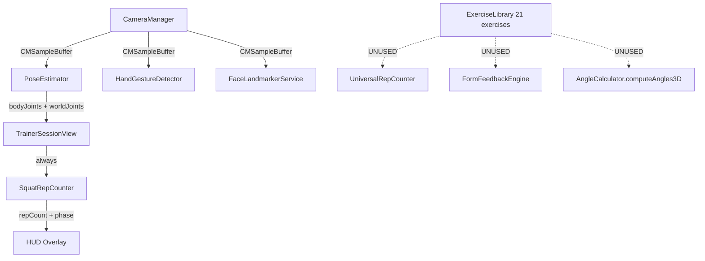
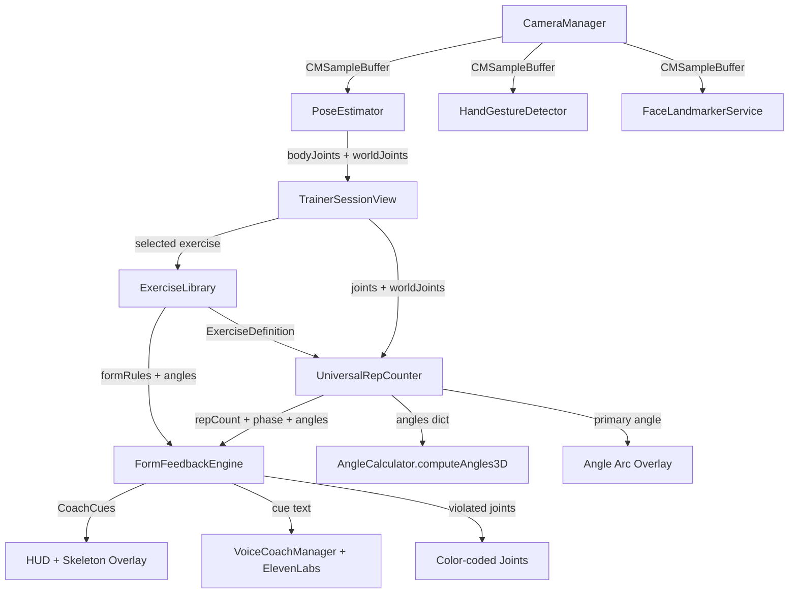

# Deep Analysis: MediaPipe Capabilities, Exercise Resources, and Real-Time Coaching Plan

---

## 1. What MediaPipe Actually Provides (and Does NOT Provide)

### What it gives you (already in your project)

MediaPipe Pose Landmarker provides **33 body landmarks** in both **2D normalized** and **3D world coordinates** (meters, hip-centered). Your project uses the `pose_landmarker_full.task` model via `MediaPipeTasksVision` 0.10.33 and correctly extracts both coordinate systems in [PoseEstimator.swift](VirtualTrainer/Vision/PoseEstimator.swift).

**Key capabilities you are already leveraging:**

- 33-point skeleton with visibility scores per joint
- 3D world landmarks (camera-independent, metric) for angle accuracy
- Live-stream mode at real-time FPS
- Segmentation mask output (enabled but unused)
- Synthetic joints (`neck`, `root` as shoulder/hip midpoints) via [JointName.swift](VirtualTrainer/Vision/JointName.swift)

**What MediaPipe does NOT provide:**

- **No consolidated exercise list, no joint angle database, no form rules** -- MediaPipe is purely a landmark detector. It outputs 33 (x,y,z) coordinates per frame. It has zero awareness of what exercise is being performed, what correct form looks like, or what angles are "good."
- No rep counting logic
- No coaching or feedback system
- No exercise classification
- No biomechanical constraints or range-of-motion standards

The intelligence about *what constitutes correct exercise form* must come from **your application layer** -- and you have already built most of it.

---

## 2. Your Project's Current State: Rich Infrastructure, Critical Disconnects

### What is already built (and well-designed)

Your codebase has a surprisingly complete architecture for data-driven exercise coaching:


| Component                                                       | File                                                                              | Status                            |
| --------------------------------------------------------------- | --------------------------------------------------------------------------------- | --------------------------------- |
| 21 exercise definitions with angles, thresholds, form rules     | [ExerciseLibrary.swift](VirtualTrainer/Models/ExerciseLibrary.swift)              | **Built, UNUSED in live session** |
| Universal data-driven rep counter                               | [UniversalRepCounter.swift](VirtualTrainer/RepCounting/UniversalRepCounter.swift) | **Built, UNUSED in live session** |
| Form feedback engine with cooldowns, severity, personality      | [FormFeedbackEngine.swift](VirtualTrainer/Coaching/FormFeedbackEngine.swift)      | **Built, UNUSED anywhere**        |
| 3D angle calculator with exercise-definition-driven computation | [AngleCalculator.swift](VirtualTrainer/Vision/AngleCalculator.swift)              | **Built, UNUSED by live session** |
| Hard-coded squat-only counter                                   | [SquatRepCounter.swift](VirtualTrainer/RepCounting/SquatRepCounter.swift)         | **Only thing actually wired up**  |


### The core problem (line 43 of TrainerSessionView.swift)

```swift
private let repCounter = SquatRepCounter()
```

**Every exercise -- bicep curls, push-ups, lunges, planks, yoga -- runs through the squat knee-angle state machine.** The user can select any of 21 exercises from the dashboard, but the session always counts reps using squat logic (hip-knee-ankle angle, thresholds 120/150).

### Specific disconnects

1. `**TrainerSessionView` line 43** hardcodes `SquatRepCounter()` instead of instantiating `UniversalRepCounter(exerciseType:)` from the selected exercise.
2. `**FormFeedbackEngine`** is never instantiated or called from any view. The rich `formRules` in every `ExerciseDefinition` (squat depth, back straight, elbow swing for curls, body line for push-ups, etc.) are dead code.
3. `**UniversalRepCounter.processJoints(... formEngine:)`** accepts a `FormFeedbackEngine?` parameter but never calls it internally -- it was designed to be integrated but the integration was never finished.
4. **Debug angle badge** on line 469 always shows "Knee" regardless of exercise:

```swift
   Text("Knee: \(Int(angle))deg")
   

```

1. **Voice coaching** is a no-op stub -- `VoiceCoachManager` methods are empty, and `ElevenLabsService` (with an embedded API key) is never called.
2. **Camera is always front-facing** -- exercises like lunges, front raises, and plank that specify `cameraPosition: .side` never switch the camera or even warn the user.

---

## 3. External Exercise Resources Available

Since MediaPipe provides zero exercise knowledge, here are the best external resources:


| Resource                           | What it offers                                                                                                                                    | How to use it                                                                          |
| ---------------------------------- | ------------------------------------------------------------------------------------------------------------------------------------------------- | -------------------------------------------------------------------------------------- |
| **Your own ExerciseLibrary.swift** | 21 exercises, 40+ angle definitions, 35+ form rules with personality-keyed coaching cues                                                          | **Already built -- just wire it up**                                                   |
| **QuickPose.ai**                   | Commercial SDK with similar exercise library (bicep curls, squats, lunges, etc.) plus ROM measurements for knee, hip, elbow, shoulder, back, neck | Competitor reference; your library already matches their exercise coverage             |
| **ExerciseDB API**                 | 11,000+ exercises with muscle targets, coaching cues, images/videos                                                                               | Good for expanding exercise metadata (descriptions, muscle diagrams) but no angle data |
| **ExRx.net / ACSM / NSCA**         | Clinical joint ROM standards (e.g., knee flexion 0-135deg, hip flexion 0-120deg, shoulder abduction 0-180deg)                                     | Useful for validating your `formRule` angle thresholds against biomechanical norms     |
| **AthletePose3D dataset**          | 1.3M frames across 12 athletic movements with validated 3D poses                                                                                  | Research reference for validating MediaPipe accuracy on athletic movements             |
| **MM-Fit dataset**                 | 800+ minutes, 10 exercises with multi-modal sensor data and joint angle specs                                                                     | Ground-truth validation dataset                                                        |


**Key insight: You do NOT need external resources for the exercise definitions.** Your `ExerciseLibrary.swift` already contains clinically reasonable angle thresholds and well-written form rules for 21 exercises. The gap is not in the data -- it's that the data is never used at runtime.

---

## 4. Is a Real-Time Coaching Layer Possible? Absolutely Yes.

### What "coaching" means in this context

A coaching layer checks joint angles against exercise-specific biomechanical rules every frame and provides corrective feedback. Your codebase already defines this architecture completely:

```
Camera Frame
    -> MediaPipe Pose Landmarker (33 landmarks, 2D + 3D)
    -> AngleCalculator.computeAngles3D(joints2D:joints3D:for:definition)
    -> UniversalRepCounter.processJoints() [rep counting via thresholds]
    -> FormFeedbackEngine.evaluate(joints:angles:phase:definition:personality:)
    -> CoachCue displayed on HUD / spoken via TTS
```

**This entire pipeline is already coded. It just needs to be connected.**

### What the form rules already cover (examples from ExerciseLibrary.swift)

- **Squat**: depth check (knee < 110deg), back straightness (hip angle > 60deg)
- **Bicep curl**: full contraction (elbow < 50deg), no swinging (shoulder angle < 40deg)
- **Push-up**: depth (elbow < 100deg), body line straightness (shoulder-hip-ankle > 155deg)
- **Plank**: sag detection (body line > 160deg), pike detection (body line < 185deg)
- **Lateral raises**: arm height (shoulder abduction > 80deg), elbow lock (elbow > 150deg)
- **Warrior II**: knee depth (knee < 100deg), arm height (shoulder abduction > 75deg)

Each rule has: angle key, min/max thresholds, active phases, cooldown, severity, and two feedback strings (encouraging "good" coach vs demanding "drill" coach).

---

## 5. Concrete Implementation Plan

### Phase 1: Wire up existing infrastructure (HIGH IMPACT, LOW EFFORT)

**Task 1.1 -- Replace SquatRepCounter with UniversalRepCounter in TrainerSessionView**

In [TrainerSessionView.swift](VirtualTrainer/UI/TrainerSessionView.swift), change line 43 from:

```swift
private let repCounter = SquatRepCounter()
```

to dynamically create a `UniversalRepCounter` based on the selected exercise. This requires making the counter a `@State` variable initialized from `workout.exercises.first?.exerciseType`.

**Task 1.2 -- Instantiate and wire FormFeedbackEngine**

Add a `FormFeedbackEngine` instance to `TrainerSessionView`. In the `.onChange(of: poseEstimator.bodyJoints)` block (lines 98-135), after calling `processJoints()`, call:

```swift
let feedbacks = formEngine.evaluate(
    joints: joints,
    angles: universalCounter.lastAngles,
    phase: currentPhase,
    definition: exerciseDef,
    personality: coachPersonality
)
coachCues = feedbacks.map { $0.asCoachCue }
```

**Task 1.3 -- Fix debug angle badge to be dynamic**

Replace hardcoded "Knee" label with the exercise's `primaryAngleKey` label from the definition.

### Phase 2: Enhance the coaching layer

**Task 2.1 -- Add real-time angle overlay on skeleton**

Extend [TrainerOverlayView.swift](VirtualTrainer/UI/TrainerOverlayView.swift) to render arc indicators and degree values at the tracked joints. The angles are already computed -- they just need to be passed to the overlay and drawn at the corresponding 2D joint positions.

**Task 2.2 -- Add color-coded joint highlighting**

When a `FormRule` is violated, highlight the relevant joint on the skeleton overlay in red/amber. This gives the user immediate spatial feedback about *where* the form issue is.

**Task 2.3 -- Camera position guidance**

When the selected exercise has `cameraPosition: .side`, show a pre-session instruction and optionally switch to the rear camera, or display a persistent "Turn sideways" indicator.

**Task 2.4 -- Add temporal smoothing to angle readings**

Apply an exponential moving average (EMA) filter to angle readings to reduce jitter. This prevents rapid false-positive form violations from momentary landmark noise. A 3-5 frame window is typical.

### Phase 3: Advanced coaching features

**Task 3.1 -- Wire voice coaching to ElevenLabs**

Connect `VoiceCoachManager` to `ElevenLabsService` to speak form cues and rep counts. The service exists, the API key is embedded (should be moved to config), and the coach cue text is already personality-aware.

**Task 3.2 -- Add rep quality scoring**

`UniversalRepCounter` already tracks `extremeAngleDuringDown` (deepest angle per rep). Expose a per-rep quality percentage (how close to `qualityTarget`) and display it briefly after each rep.

**Task 3.3 -- Set advancement and workout completion**

Wire `WorkoutPlan.exercises` and `targetReps` so the session auto-advances through sets and shows a completion screen.

**Task 3.4 -- Isometric hold timer display**

For exercises like plank, downward dog, and warrior II (where `movementType == .isometric`), replace the rep counter with a visible hold timer and progress ring.

### Phase 4: Accuracy improvements

**Task 4.1 -- Validate angle thresholds against ACSM/NSCA standards**

Cross-reference your `formRule` thresholds with published ROM norms (ExRx.net has ACSM-referenced values). For example, verify that squat depth target of 110deg knee angle approximates "parallel" correctly.

**Task 4.2 -- Add bilateral asymmetry detection**

Use the `side: .both` angle definitions to detect left/right imbalance. If left knee angle differs from right by > 15deg during squats, emit a coaching cue.

**Task 4.3 -- Use segmentation mask for body positioning**

The segmentation mask (already enabled in `PoseEstimator`) can determine what percentage of the frame the user occupies, enabling "step closer" or "step back" guidance with more precision than joint visibility alone.

---

## 6. Architecture Diagram: Current vs. Target

### Current (broken) flow:




### Target (wired up) flow:




---

## Summary

**You do not need any external exercise database.** Your `ExerciseLibrary.swift` already contains a comprehensive, well-structured set of 21 exercises with 40+ angle definitions and 35+ form rules. MediaPipe's model provides the raw landmark data. The coaching intelligence is in your application code -- it is already written and just needs to be connected. The single most impactful change is replacing `SquatRepCounter()` with `UniversalRepCounter(exerciseType:)` on line 43 of `TrainerSessionView.swift` and wiring `FormFeedbackEngine` into the per-frame processing loop.