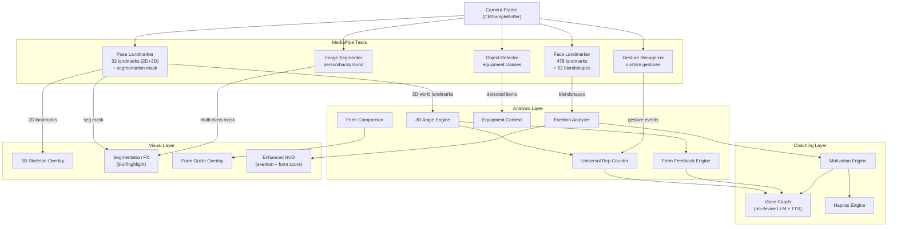

# MediaPipe iOS Capabilities: Gap Analysis and Feature Roadmap

## Current State Summary

VirtualTrainer currently uses **2 of 10+** MediaPipe iOS tasks:

| MediaPipe Task | Used? | How |
| -------------- | ----- | --- |

- **Pose Landmarker** -- YES, but only 2D normalized landmarks (x,y), discarding world landmarks (3D meters) and segmentation mask output
- **Hand Landmarker** -- YES, but only during pre-exercise ready flow; disabled during workout; custom gesture logic on raw landmarks (not using Gesture Recognizer task)
- **Face Detector** -- NO
- **Face Landmarker (478 pts + Blendshapes)** -- NO
- **Gesture Recognizer** -- NO (hand gestures are manually coded from raw hand landmarks)
- **Image Segmenter** -- NO
- **Interactive Segmenter** -- NO
- **Object Detector** -- NO
- **Image Classifier** -- NO
- **Image Embedder** -- NO
- **Holistic Landmarker (pose+face+hands unified)** -- NO
- **LLM Inference (GenAI)** -- NO

---

## Tier 1: High-Impact, Low Effort (Unlocking Data Already Available)

### 1. 3D World Landmarks for True Angle Accuracy

**Gap:** `PoseEstimator.swift` reads only `result.landmarks` (2D normalized). It completely ignores `result.worldLandmarks` -- real-world 3D coordinates in meters with hip-center origin.

**Why it matters:** 2D angles are distorted by camera perspective. A squat viewed slightly from the side produces incorrect knee angles in 2D. World landmarks give camera-independent joint angles, critical for exercises like squats, lunges, and overhead press where depth matters.

**What to build:**

- Publish `worldJoints: [JointName: SIMD3<Float>]` from `PoseEstimator`
- Extend `AngleCalculator` with a `angle3D(a:b:c:) -> Float` method using SIMD vectors
- Use 3D angles as the primary input to `UniversalRepCounter` and `FormFeedbackEngine`
- Fall back to 2D for overlay rendering

This is effectively a ~50 line change in `[PoseEstimator.swift](VirtualTrainer/Vision/PoseEstimator.swift)` (lines 115-156, the `processResult` method) plus an extension to `[AngleCalculator.swift](VirtualTrainer/Vision/AngleCalculator.swift)`.

### 2. Pose Segmentation Mask (Built into Pose Landmarker)

**Gap:** The Pose Landmarker already supports outputting a body segmentation mask alongside landmarks -- it just needs `outputSegmentationMasks = true` on the existing `PoseLandmarkerOptions`. Zero additional models needed.

**Why it matters:** Enables a clean body silhouette overlay, visual "highlight zone" on the working muscle group, and a polished AR-like camera experience (background dimming/blur to focus on the user).

**What to build:**

- Set `options.outputSegmentationMasks = true` in `PoseEstimator.configurePoseLandmarker()`
- Publish the mask as a `CGImage` or `CVPixelBuffer`
- Render in `TrainerOverlayView` as a translucent body highlight or background blur

### 3. Activate the Gesture Recognizer Task (Replace Custom Logic)

**Gap:** `HandGestureDetector` manually classifies gestures (thumbsUp, fist, openPalm) from raw landmark geometry. MediaPipe has a dedicated **Gesture Recognizer** task that does this natively with higher accuracy and supports **custom trained gestures** via Model Maker.

**Why it matters:** The current manual logic is fragile (thresholds on normalized Y coordinates, no rotation invariance). The Gesture Recognizer handles edge cases, varied hand orientations, and can be extended with custom gestures (e.g., "stop" palm, "OK" sign, number selection 1-5).

**What to build:**

- Replace `HandLandmarker` with `GestureRecognizer` in `HandGestureDetector`
- Map MediaPipe's recognized gesture categories to the existing `HandGesture` enum
- Add new gesture types for mid-workout control (pause, skip set, etc.)

---

## Tier 2: High-Impact, Medium Effort (New MediaPipe Tasks)

### 4. Face Landmarker for Fatigue and Exertion Detection

**Gap:** No face analysis exists in the project. MediaPipe's Face Landmarker detects **478 3D facial landmarks** and outputs **52 blendshape coefficients** representing facial expressions.

**Why it matters for a fitness app:**

- **Exertion scoring** from brow furrow (`browDownLeft/Right`), jaw clench (`jawOpen` inverse), eye squint (`eyeSquintLeft/Right`) blendshapes
- **Breathing detection** from `jawOpen` + `mouthOpen` oscillation patterns
- **Fatigue detection** from drooping eyelids (`eyeBlinkLeft/Right`), reduced facial engagement over time
- **User engagement** -- detect if user is looking at screen vs. distracted (head pose from 478 landmarks)
- **Safety** -- detect signs of extreme strain or distress

**What to build:**

- New `FaceLandmarkerService` running the `face_landmarker.task` model
- `ExertionAnalyzer` that maps blendshape coefficients to an exertion score over time
- Feed exertion data into `MotivationEngine` and `VoiceCoachManager` for adaptive coaching cues ("You're pushing hard -- great intensity!" vs. "Take a breather if you need one")

### 5. Image Segmentation for Visual Polish and UX

**Gap:** No segmentation is used. MediaPipe's `ImageSegmenter` provides multi-class segmentation (person, hair, face skin, clothing, accessories, background).

**Why it matters:**

- **Background replacement/blur** during workouts for privacy and focus
- **Body part highlighting** -- light up the muscles being worked (overlay colored regions on arms during bicep curls)
- **"Ghost rep" overlay** -- capture the user's silhouette at peak form, display it as a translucent guide for subsequent reps
- **Social sharing** -- clean segmented clips of workout highlights

**What to build:**

- New `BodySegmenter` service using `ImageSegmenter` with the selfie segmentation model
- Real-time background blur/replace in `CameraPreviewView`
- Muscle zone highlighting overlay keyed to the current `ExerciseType.targetMuscles`

### 6. Object Detection for Equipment Recognition

**Gap:** The app has no awareness of workout equipment. MediaPipe's Object Detector supports custom models via Model Maker.

**Why it matters:**

- **Auto-detect exercise type** from visible equipment (dumbbell -> curl/press, resistance band -> pull-apart, mat -> floor exercises)
- **Safety checks** -- detect if the user is too close to furniture, or if equipment is in the frame when it shouldn't be
- **Rep quality** -- for exercises with equipment, verify the equipment is in the correct position/orientation

**What to build:**

- Train a custom object detection model (via MediaPipe Model Maker) on fitness equipment classes: dumbbell, barbell, resistance band, yoga mat, kettlebell, bench
- New `EquipmentDetector` service
- Feed detected equipment into the exercise recommendation flow on `HomeDashboardView`

---

## Tier 3: Differentiating Features (Combining Multiple Tasks)

### 7. Holistic Landmarker (Simultaneous Face + Hands + Pose)

**Gap:** Currently, pose and hand detection run as separate pipelines, and hand detection is **disabled during exercise** to save CPU. The Holistic Landmarker runs all three (pose 33 + hands 42 + face 478 = **543 landmarks**) in a single optimized pipeline.

**Why it matters:**

- Enables **hand tracking during exercise** without the CPU penalty of two separate models
- Tracks **grip position** on equipment during curls, presses
- Facial expression analysis simultaneously with body pose
- Single-pipeline means better temporal coherence between face, hand, and body landmarks

**Consideration:** Holistic Landmarker iOS support was added in 2024 but may have stability caveats. Test thoroughly before shipping.

### 8. Image Embedder for "Form Comparison" / Reference Pose Matching

**Gap:** No pose similarity scoring exists. MediaPipe's `ImageEmbedder` generates feature vectors with built-in cosine similarity.

**Why it matters:**

- **"Match the coach"** mode: show a reference pose image, compute embedding similarity with the user's current frame, display a match percentage
- **Personal best tracking**: embed the user's best-form frame per exercise, compare future reps against it
- **Exercise classification from pose**: embed current body configuration, compare against a library of exercise-pose embeddings to auto-identify what exercise the user is doing

**What to build:**

- `FormComparisonEngine` using `ImageEmbedder`
- Reference pose image library per exercise
- Real-time similarity score displayed on the HUD

### 9. On-Device LLM for Intelligent Coaching

**Gap:** `VoiceCoachManager` is a stub. `ElevenLabsService` requires network. MediaPipe's **LLM Inference API** can run Gemma-2 2B locally on-device.

**Why it matters:**

- **Fully offline** natural language coaching -- generate contextual encouragement, form tips, workout summaries without network
- **Personalized** -- the LLM can incorporate the user's rep history, form scores, and fatigue data to generate unique coaching text each session
- Feed generated text into iOS `AVSpeechSynthesizer` for instant local TTS, or batch to ElevenLabs for premium voice

**Caveat:** LLM Inference API is marked deprecated in favor of LiteRT-LM; evaluate which path is more stable. Model size (~2GB for Gemma-2 2B quantized) is significant for app size.

---

## Tier 4: Advanced / Exploratory

### 10. Multi-Person Pose Detection

**Gap:** `PoseEstimator` is configured with `numPoses = 1`. MediaPipe supports multi-person detection.

**Use case:** Partner workouts, group classes, or a "trainer demo" mode where the coach and user are both on screen with separate skeleton overlays and independent rep counting.

### 11. Image Classifier for Automatic Exercise Recognition

**Gap:** Exercise type is manually selected by the user on the home screen.

**Use case:** Train a custom image classifier (via Model Maker) on frames of different exercises. Auto-detect what exercise the user is performing and switch rep counting / form rules dynamically. This eliminates the exercise selection step entirely.

### 12. Interactive Segmenter for Tap-to-Focus

**Gap:** No interactive segmentation. MediaPipe's Interactive Segmenter lets the user tap a point to segment that specific object.

**Use case:** User taps on a piece of equipment or a body part to get detailed information, or to set a "focus zone" for form feedback.

---

## Data Flow Opportunity: What a "Fully Leveraged" MediaPipe Stack Looks Like

---

## Recommended Implementation Priority

1. **3D world landmarks + 3D angle calculation** -- highest ROI, smallest change, fixes fundamental accuracy issue
2. **Pose segmentation mask** -- single boolean flag to enable, immediate visual upgrade
3. **Gesture Recognizer task** -- replaces fragile custom code, unlocks mid-workout gesture control
4. **Face Landmarker + exertion analysis** -- unique differentiator, makes coaching feel "alive"
5. **Image Segmenter for background blur** -- visual polish, privacy feature
6. **Object Detector for equipment** -- smart exercise suggestions
7. **Holistic Landmarker** -- unified pipeline if performance allows
8. **Image Embedder for form comparison** -- "match the coach" feature
9. **On-device LLM** -- offline intelligent coaching (evaluate model size trade-off)
10. **Multi-person, auto-classification, interactive segmenter** -- future exploration

