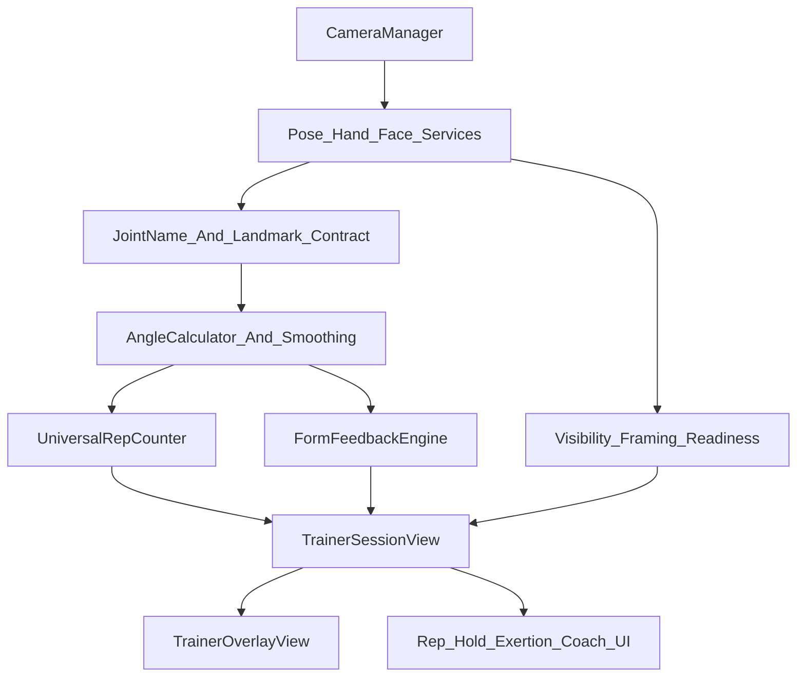

# Revised Spotter Biomechanics Upgrade Plan

## Validation Summary

`SPOTTER_AUDIT.md` is directionally strong and mostly matches the runtime code. The biggest confirmed additions to the earlier plan are:

- MediaPipe timestamp handling should use `CMSampleBuffer` presentation timestamps in [`VirtualTrainer/Vision/PoseEstimator.swift`](VirtualTrainer/Vision/PoseEstimator.swift), [`VirtualTrainer/Vision/HandGestureDetector.swift`](VirtualTrainer/Vision/HandGestureDetector.swift), and [`VirtualTrainer/Vision/FaceLandmarkerService.swift`](VirtualTrainer/Vision/FaceLandmarkerService.swift).
- Rendered landmarks are not smoothed; only derived angles get EMA smoothing in [`VirtualTrainer/RepCounting/UniversalRepCounter.swift`](VirtualTrainer/RepCounting/UniversalRepCounter.swift).
- `VoiceCoachManager` is a stub, while [`VirtualTrainer/Services/ElevenLabsService.swift`](VirtualTrainer/Services/ElevenLabsService.swift) exists but is not wired into the session voice path.
- `SquatRepCounter` is unused legacy code with divergent thresholds and should be isolated or removed after tests prove `UniversalRepCounter` coverage.
- `TrainerSessionView.buildAngleOverlays` currently resolves right-side triples first, so overlays can disagree with `.both`, `.bestAvailable`, or active-side measurements.
- Face/exertion is partially surfaced: `effortScore` appears in the HUD, but `fatigueLevel` is not product-visible.

Corrections to treat carefully:

- The app has 29 runtime exercises, not 30.
- Coach personality is not banner-only: `FormFeedbackEngine` does select `feedbackGood` vs `feedbackDrill`; the missing part is actual voice playback.
- ROM scoring is not strictly single-angle: `calculateFormScore` uses all `idealAngles`, but the generic quality cue still uses only the primary extreme angle.
- Front-raise sway may be coherent as written, but it needs a fixture/runtime sign test before changing thresholds.
- Warrior `armLineAngle` is affected by the `shoulder_center` bug, but current warrior form rules use `shoulderAbductionAngle`, so the bug mainly affects computed angles/overlays unless that rule is added.

## No-Regression Contract

The upgrade must preserve these existing user-visible systems:

- Skeleton and hand overlay from [`VirtualTrainer/UI/TrainerOverlayView.swift`](VirtualTrainer/UI/TrainerOverlayView.swift), including body bones, hand bones, angle arcs, and violation highlights.
- Pose, hand, and face MediaPipe services from [`VirtualTrainer/Vision/PoseEstimator.swift`](VirtualTrainer/Vision/PoseEstimator.swift), [`VirtualTrainer/Vision/HandGestureDetector.swift`](VirtualTrainer/Vision/HandGestureDetector.swift), and [`VirtualTrainer/Vision/FaceLandmarkerService.swift`](VirtualTrainer/Vision/FaceLandmarkerService.swift).
- Current `JointName` raw values and synthetic `.neck` / `.root` IDs in [`VirtualTrainer/Vision/JointName.swift`](VirtualTrainer/Vision/JointName.swift).
- Rep and hold UI contracts in [`VirtualTrainer/RepCounting/RepCounterProtocol.swift`](VirtualTrainer/RepCounting/RepCounterProtocol.swift): `repCount`, `phase`, `holdDuration`, `isHolding`, `cues`, and `formScore`.
- Coach personality text paths through [`VirtualTrainer/Models/WorkoutData.swift`](VirtualTrainer/Models/WorkoutData.swift), [`VirtualTrainer/Coaching/FormFeedbackEngine.swift`](VirtualTrainer/Coaching/FormFeedbackEngine.swift), [`VirtualTrainer/Coaching/WorkoutReadyCoordinator.swift`](VirtualTrainer/Coaching/WorkoutReadyCoordinator.swift), and [`VirtualTrainer/Coaching/MotivationEngine.swift`](VirtualTrainer/Coaching/MotivationEngine.swift).
- Distance, body visibility, segmentation-mask framing, and readiness flow via [`VirtualTrainer/Vision/BodyVisibilityChecker.swift`](VirtualTrainer/Vision/BodyVisibilityChecker.swift), [`VirtualTrainer/Vision/FramePositionAnalyzer.swift`](VirtualTrainer/Vision/FramePositionAnalyzer.swift), and [`VirtualTrainer/Coaching/WorkoutReadyCoordinator.swift`](VirtualTrainer/Coaching/WorkoutReadyCoordinator.swift).
- Exertion HUD behavior from [`VirtualTrainer/Coaching/ExertionAnalyzer.swift`](VirtualTrainer/Coaching/ExertionAnalyzer.swift) and face blendshape updates in [`VirtualTrainer/UI/TrainerSessionView.swift`](VirtualTrainer/UI/TrainerSessionView.swift).
- Home exercise selection and workout creation in [`VirtualTrainer/UI/HomeDashboardView.swift`](VirtualTrainer/UI/HomeDashboardView.swift) and [`VirtualTrainer/Models/WorkoutData.swift`](VirtualTrainer/Models/WorkoutData.swift).

Do not branch the SwiftUI session into multiple flows. Any new biomechanics engine should sit behind the same output contracts used by `TrainerSessionView`.

## Phase 0: Safety Harness Before Behavior Changes

Build confidence before modifying biomechanics behavior:

- Add an XCTest target for pure logic tests if none exists.
- Add fixture tests for [`VirtualTrainer/Vision/AngleCalculator.swift`](VirtualTrainer/Vision/AngleCalculator.swift): 2D angles, 3D angles, `.root`, `.neck`, `hip_center`, `shoulder_center`, `.both`, `.bestAvailable`, and signed body-line cases.
- Add rep-counter sequence tests for [`VirtualTrainer/RepCounting/UniversalRepCounter.swift`](VirtualTrainer/RepCounting/UniversalRepCounter.swift): full reps, half reps, bounce noise, fast cadence, slow cadence, and isometric hold entry/exit.
- Add visibility and framing tests for [`VirtualTrainer/Vision/BodyVisibilityChecker.swift`](VirtualTrainer/Vision/BodyVisibilityChecker.swift) and [`VirtualTrainer/Vision/FramePositionAnalyzer.swift`](VirtualTrainer/Vision/FramePositionAnalyzer.swift) using synthetic landmarks and masks.
- Add exercise-library invariant tests for [`VirtualTrainer/Models/ExerciseLibrary.swift`](VirtualTrainer/Models/ExerciseLibrary.swift): every `primaryAngleKey` exists, threshold angle keys match, impossible 0-180 rules are flagged, all `ExerciseType` cases have definitions, and all category options map to available definitions.
- Add a lightweight debug fixture mode if needed, but keep it outside the user-facing workout path.

## Phase 1: Low-Risk Correctness Fixes

Apply fixes that improve correctness while preserving current APIs:

- Map `hip_center` to `.root` and `shoulder_center` to `.neck` in [`VirtualTrainer/Vision/AngleCalculator.swift`](VirtualTrainer/Vision/AngleCalculator.swift). Confirm hip abduction, jumping jack leg spread, and warrior arm overlays still render.
- Replace wall-clock timestamps with `CMSampleBuffer` PTS in the three MediaPipe services. Keep the monotonic guard, but base it on capture time.
- Add a `neck` to `root` visual spine bone in [`VirtualTrainer/Vision/JointName.swift`](VirtualTrainer/Vision/JointName.swift) only if overlay snapshots/manual QA confirm it improves readability without clutter.
- Fix `TrainerSessionView.buildAngleOverlays` so overlay side selection follows the measured side or active side instead of always resolving right first.
- Keep `JointName` raw values, published landmark dictionaries, and `TrainerOverlayView` props unchanged.

## Phase 2: Rep Phase And Isometric Semantics

Fix the engine behavior that makes several existing rules unreliable:

- Make the `up` phase observable for at least a stable frame window, or introduce explicit transition events while preserving `RepCounterOutput.phase` for UI compatibility.
- Ensure rules currently active during `"up"` can fire reliably: curl extension, hammer extension, deadlift lockout, shoulder press depth, tricep dip lockout, push-up sag/pike variants, and leg-straight rules.
- Add an isometric valid-band model so plank, wall sit, downward dog, and warrior can require an acceptable range rather than a one-sided threshold.
- Keep `holdDuration`, `isHolding`, and the existing isometric HUD behavior stable in [`VirtualTrainer/UI/TrainerSessionView.swift`](VirtualTrainer/UI/TrainerSessionView.swift).
- Add tests before and after the phase change to prove rep counts do not regress for squats, curls, push-ups, and one top-contraction exercise such as glute bridge.

## Phase 3: Active-Side And Bilateral Measurement Upgrade

Resolve the main unilateral/alternating exercise problem without breaking bilateral exercises:

- Add measurement semantics beyond `.left`, `.right`, `.both`, and `.bestAvailable`, such as active side, more-flexed side, less-flexed side, higher-excursion side, and camera-near side.
- Use active-side logic for lunges, side lunges, knee raises, high knees, mountain climbers, hip abduction, warrior front knee, and future unilateral exercises.
- Disable or contextualize generic bilateral asymmetry cues for exercises where left and right are expected to differ.
- Preserve `.both` averaging for truly bilateral movements such as squats, bicep curls, lateral raises, jumping jacks arms, and overhead reach.
- Ensure angle overlays and violated-joint highlights use the same side decision as the counter and form engine.

## Phase 4: Body-Line, Positional Checks, And Form Feedback

Upgrade form rules from fragile angle heuristics into clearer movement primitives:

- Replace folded 0-180 body-line logic with signed body-line deviation where needed, especially push-up and plank sag/pike detection.
- Retune push-up rules so pike and sag cues can actually fire and do not overlap incorrectly.
- Promote positional checks into first-class feedback with severity ordering instead of only running them when no form rule fires.
- Add persistence-frame requirements for noisy checks such as heel rise and valgus.
- Normalize positional checks to body scale where practical, not fixed frame percentages alone.
- Keep frame-position feedback and joint-visibility feedback higher priority than form cues.
- Update `buildViolatedJoints` to highlight positional-check violations as well as `FormRule` violations.

## Phase 5: MediaPipe Quality And Performance Without UX Regression

Improve polish and runtime quality behind existing outputs:

- Add landmark smoothing with a One Euro filter or equivalent confidence-aware filter before overlay rendering and angle calculation. Tune conservatively to avoid lagging fast reps.
- Keep the existing angle EMA initially; adjust only after tests and device QA show the new smoothing is stable.
- Consider GPU delegates for pose, hand, and face services with a CPU fallback for simulator or unsupported devices.
- Add simple instrumentation for inference latency, dropped frames, and current FPS in a debug-only path.
- Do not remove segmentation masks; they are required for current framing and distance feedback.

## Phase 6: Per-Rep Telemetry And Scoring

Add analytics without changing the visible session flow first:

- Add a `RepRecord` model inside the rep engine/session layer capturing rep index, start/end time, phase durations, peak angles, form score, feedback rule IDs, and quality flags.
- Align the generic ROM cue with the multi-angle `idealAngles` logic already used by `calculateFormScore`.
- Add eccentric/concentric duration and peak angular velocity where phase semantics allow it.
- Track ROM drift and tempo drift across a set, but initially expose only in debug or a non-intrusive summary.
- Keep existing `FormScore` fields and HUD rendering stable until a new UI is intentionally designed.

## Phase 7: Exercise-Specific Fixes Before New Exercises

Retune existing exercises before expanding the library:

- Calf raise: replace knee-angle primary counting with ankle plantarflexion or heel/foot-index displacement; keep knee-straight as a form rule.
- Deadlift: reword back-rounding claims to hip-hinge and torso-position cues unless a real spine signal is added.
- Push-up and plank: fix signed body line and camera-view guidance.
- Lunge, side lunge, knee raise, high knees, mountain climber: use active-side tracking.
- Hip abduction and jumping jacks: verify corrected pelvis midpoint changes thresholds and retune with fixtures.
- Lateral raise: replace shoulder-level “shrug” with a real shrug or trap-elevation check if baseline data supports it.
- Cobra wings and hammer curl: either reframe the exercises to what MediaPipe can measure or label them as lower-confidence because scapular retraction and wrist pronation/supination are not directly observable.
- Yoga: improve existing warrior and downward dog before adding many more poses.

## Phase 8: Voice, Coach Personalities, And Motivation

Preserve current text personalities while adding real audio safely:

- Keep `feedbackGood` and `feedbackDrill` selection unchanged in `FormFeedbackEngine`.
- Implement `VoiceCoachManager` behind its existing API first, using local `AVSpeechSynthesizer` as a reliable baseline.
- Wire `ElevenLabsService` only after local TTS works and cue priority/ducking exists.
- Add a cue queue so critical form cues can interrupt or suppress rep-count chants.
- Keep `voiceErrorBanner` behavior in `TrainerSessionView` so failures are visible but non-fatal.
- Preserve haptics on ready countdown, reps, warnings, and motivation.

## Phase 9: New Exercise Expansion

Add exercises only after phases 0-7 are stable:

- First candidates: chair sit-to-stand, incline or wall push-up, reverse crunch, bird dog, donkey kick, side plank, Romanian deadlift, hip thrust, reverse lunge, and step-up.
- Add yoga poses after isometric valid-band support: chair pose, tree pose, triangle pose, warrior I, warrior III, cobra/up-dog, mountain pose.
- Each new exercise must ship with fixture tests, expected camera view, required joints, active-side semantics, form rules, and fallback behavior when landmarks are missing.
- Avoid promising detection of unobservable signals such as lumbar rounding, scapular retraction, grip orientation, exact load/bar path, or injury risk.

## Manual QA Gates For Every Phase

Before merging each phase, manually verify:

- Skeleton and hand overlays draw and remain aligned with the camera preview.
- Angle overlays appear for the selected exercise and are on the measured side.
- Rep count increments once per full rep and does not double-count bounce or jitter.
- Isometric timer counts only while in a valid hold.
- Distance/framing/readiness still blocks sessions when body or required joints are not visible.
- Thumbs-up and thumbs-down readiness still work.
- Coach personality text still changes between Good Coach and Drill Sergeant.
- Exertion badge still appears when face is detected.
- Motivation overlay and haptics still fire on reps/milestones.
- Voice failures do not crash or block the workout.

## Build Order Recommendation

Recommended sequence:

- First: Phase 0 tests and invariants.
- Second: Phase 1 low-risk correctness fixes.
- Third: Phase 2 rep/isometric semantics.
- Fourth: Phase 3 active-side measurement.
- Fifth: Phase 4 form feedback and body-line upgrades.
- Sixth: Phase 5 MediaPipe smoothing/performance.
- Seventh: Phase 6 telemetry.
- Eighth: Phase 7 existing exercise retuning.
- Ninth: Phase 8 voice.
- Last: Phase 9 new exercises.

This order keeps the product stable: test contracts first, correct foundational math second, preserve session UI contracts throughout, and expand only after existing exercises are trustworthy.