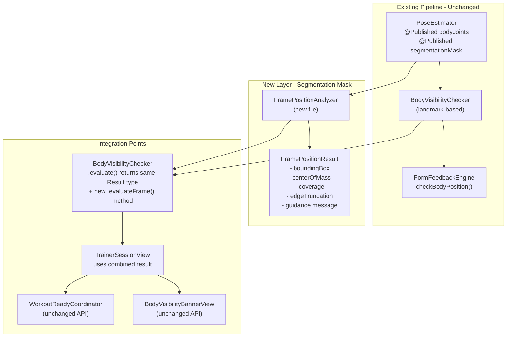

# Segmentation Mask Integration for Precise Body Positioning

## Guiding Principle

**Additive only.** Every existing code path (landmark visibility, form rules, positional checks, ready coordinator) remains untouched. The segmentation mask adds a new, higher-fidelity positioning layer that runs alongside the existing checks.

---

## Architecture




---

## Files Changed

- **NEW**: `[VirtualTrainer/Vision/FramePositionAnalyzer.swift](VirtualTrainer/Vision/FramePositionAnalyzer.swift)` -- Pure-logic struct that analyzes the segmentation mask
- **EDIT**: `[VirtualTrainer/Vision/BodyVisibilityChecker.swift](VirtualTrainer/Vision/BodyVisibilityChecker.swift)` -- Add new `evaluateFrame()` method (existing `evaluate()` untouched)
- **EDIT**: `[VirtualTrainer/Coaching/FormFeedbackEngine.swift](VirtualTrainer/Coaching/FormFeedbackEngine.swift)` -- Add new `checkFramePosition()` method integrated into evaluate priority chain
- **EDIT**: `[VirtualTrainer/UI/TrainerSessionView.swift](VirtualTrainer/UI/TrainerSessionView.swift)` -- Wire `segmentationMask` into the existing `onChange(of: bodyJoints)` block

No other files change. `PoseEstimator`, `WorkoutReadyCoordinator`, `BodyVisibilityBannerView`, `ExerciseLibrary`, `WorkoutData` are all untouched.

---

## Step 1: Create `FramePositionAnalyzer`

New file: `VirtualTrainer/Vision/FramePositionAnalyzer.swift`

A stateless `enum` (like `AngleCalculator`) that takes a `SegmentationMaskData` and returns a `FramePositionResult`.

**Computed metrics:**

- **Bounding box** (topN, bottomN, leftN, rightN in 0-1 normalized coords)
- **Center of mass** (centroidX, centroidY in 0-1)
- **Coverage ratio** (fraction of mask pixels > threshold)
- **Edge truncation** per edge (body probability sum in outermost 3% of pixels per side)
- **Guidance** -- a single `FrameGuidance` enum value plus human-readable message

`**FrameGuidance` enum:**

```swift
enum FrameGuidance: Equatable {
    case wellPositioned
    case tooClose
    case tooFar
    case offCenter(direction: Direction)
    case bodyClipped(edges: Set<Edge>)
    case noBodyDetected

    enum Direction: String { case left, right, up, down }
    enum Edge: String { case top, bottom, left, right }
}
```

**Thresholds (configurable constants):**

- Mask pixel confidence threshold: 0.5
- Edge margin: 3% of frame dimension
- Min coverage: 5% (too far)
- Max coverage: 55% (too close)
- Center tolerance: 15% offset from center (0.5) in X or Y
- Edge truncation threshold: sum > 5% of edge pixels means clipping

---

## Step 2: Extend `BodyVisibilityChecker`

Add a **new** static method alongside the existing one:

```swift
static func evaluateFrame(
    mask: SegmentationMaskData?,
    joints: [JointName: CGPoint],
    for exerciseType: ExerciseType
) -> Result
```

**Logic:**

1. Call existing `evaluate(joints:for:)` first
2. If landmark check fails (isReady == false), return that result as-is (landmarks are authoritative for "which joints are missing")
3. If landmark check passes, run `FramePositionAnalyzer.analyze(mask)` for additional positioning quality
4. If mask analysis returns `.wellPositioned`, return the landmark result unchanged
5. If mask shows a problem (too close, clipped, off-center), return `isReady = false` with the mask-derived message and the landmark visibility score
6. If mask is `nil` (rare fallback), return landmark result as-is

This ensures the existing `evaluate()` method is **never modified** -- all callers that don't pass a mask get identical behavior.

---

## Step 3: Extend `FormFeedbackEngine`

Add a new optional parameter to `evaluate()` and a new private method:

```swift
func evaluate(
    joints: ...,
    angles: ...,
    // ... existing params ...
    frameMask: SegmentationMaskData? = nil  // NEW, defaults to nil
) -> [Feedback]
```

Add `checkFramePosition()` as a **new check type** with priority between `bodyPosition` and `jointVisibility`:

```
1. checkBodyPosition     (existing -- no joints at all / < 4 joints)
2. checkFramePosition    (NEW -- mask says body is clipped/off-center/too close/far)
3. checkJointVisibility  (existing -- specific required joints missing)
4. checkFormRules         (existing)
5. checkPositionalRules   (existing)
6. checkBilateralAsymmetry (existing)
```

The new check only fires when body IS detected (joints > 4) but mask shows a framing problem. It uses the same `Feedback` struct and `.bodyPosition` type so the UI treats it identically.

Add a new `FeedbackType` case: `.framePosition` (sorts between `.bodyPosition` and `.jointVisibility`).

---

## Step 4: Wire into `TrainerSessionView`

In the existing `onChange(of: poseEstimator.bodyJoints)` block, pass the segmentation mask into the two updated callsites:

```swift
// Line ~120: Visibility check (add mask)
visibilityResult = BodyVisibilityChecker.evaluateFrame(
    mask: poseEstimator.segmentationMask,
    joints: joints,
    for: exercise
)

// Line ~150: Form feedback (add mask)
let formFeedbacks = formEngine.evaluate(
    joints: joints,
    angles: counter.lastAngles,
    // ... existing params ...
    frameMask: poseEstimator.segmentationMask  // NEW
)
```

No other changes to the view. The `visibilityResult` type is unchanged, so the banner, progress bar, and ready coordinator all work identically.

---

## Complete Messaging Catalog

### EXISTING Messages (Unchanged)


| Source                    | Condition                             | Message                                                             |
| ------------------------- | ------------------------------------- | ------------------------------------------------------------------- |
| `BodyVisibilityChecker`   | `joints.isEmpty`                      | "Step into the frame so the camera can see you"                     |
| `BodyVisibilityChecker`   | `joints` present but required missing | "Move back so your {visibilityHint} are visible"                    |
| `FormFeedbackEngine`      | `joints.isEmpty`                      | "Step into the frame so the camera can see you"                     |
| `FormFeedbackEngine`      | `joints.count < 4`                    | "Move further from the camera -- show more of your body"            |
| `FormFeedbackEngine`      | Required joints missing               | "Move your {jointList} into view"                                   |
| `WorkoutReadyCoordinator` | `.positioning`                        | "Get into position" / "Make sure the camera can see your full body" |
| All 100+ form rules       | Various angle violations              | (all unchanged -- see ExerciseLibrary)                              |


### NEW Messages (Added by segmentation mask)


| Condition                       | Good Coach Message                                                          | Drill Sergeant Message                              |
| ------------------------------- | --------------------------------------------------------------------------- | --------------------------------------------------- |
| Body too close (coverage > 55%) | "You're too close -- take a step back so the camera can see your full body" | "Back UP! You're practically kissing the camera!"   |
| Body too far (coverage < 5%)    | "You're a bit far away -- step closer to the camera"                        | "Get CLOSER! I can barely see you over there!"      |
| Body clipped at top edge        | "Your head is cut off -- step back or lower your phone"                     | "I can't see your head! Fix your camera angle NOW!" |
| Body clipped at bottom edge     | "Your feet are cut off -- step back or raise your phone"                    | "Your feet are out of frame! Step back!"            |
| Body clipped at left edge       | "You're too far left -- shift to your right"                                | "Move RIGHT! You're falling off the screen!"        |
| Body clipped at right edge      | "You're too far right -- shift to your left"                                | "Move LEFT! Center yourself!"                       |
| Body off-center left            | "Shift a bit to your right to center yourself"                              | "CENTER yourself! Move to the right!"               |
| Body off-center right           | "Shift a bit to your left to center yourself"                               | "CENTER yourself! Move to the left!"                |
| Body off-center high            | "You're too high in frame -- move the camera up or step back"               | "Fix your position! You're too high in the frame!"  |
| Body off-center low             | "You're too low in frame -- move the camera down or step back"              | "Fix your position! You're too low in the frame!"   |
| Well-positioned (mask confirms) | (no message -- falls through to existing checks)                            | (no message)                                        |
| Mask unavailable                | (silent fallback -- uses existing landmark-only path)                       | (silent fallback)                                   |


---

## Before/After Scenarios

### Scenario 1: User standing too close, but landmarks visible

- **BEFORE**: All 8 required joints for squats detected (visibility > 0.5). System says "ready." But the user's feet and head are partially clipped -- form tracking is unreliable at the edges.
- **AFTER**: Landmarks pass, but mask shows coverage at 62% and bottom-edge truncation detected. System says "You're too close -- take a step back so the camera can see your full body" and stays in `.positioning`.

### Scenario 2: User shifted to the far right of frame

- **BEFORE**: Required joints visible. System says "ready." Skeleton overlay is crammed into the right 30% of the screen. Landmark accuracy degrades at frame edges.
- **AFTER**: Landmarks pass, but mask centroid at X=0.78 (> 0.65 threshold). System says "Shift a bit to your left to center yourself." User adjusts, centroid moves to 0.52, system says "ready."

### Scenario 3: User's feet are just barely out of frame

- **BEFORE**: Ankle landmarks flicker between visible (0.51) and invisible (0.49). System oscillates between "ready" and "Move back so your full body -- shoulders to ankles are visible." Frustrating UX.
- **AFTER**: Mask consistently shows body probability at the bottom edge. System gives a stable "Your feet are cut off -- step back or raise your phone." No flickering because the mask silhouette is spatially continuous.

### Scenario 4: User is way too far from camera

- **BEFORE**: All joints detected (tiny person in frame). System says "ready." But landmarks are noisy because the person is only 50 pixels tall. Form feedback becomes unreliable.
- **AFTER**: Mask shows coverage at 3%. System says "You're a bit far away -- step closer to the camera." User moves closer, coverage rises to 20%, system proceeds to ready check.

### Scenario 5: Perfect positioning

- **BEFORE**: All joints visible. System says "ready."
- **AFTER**: All joints visible AND mask confirms: coverage 25%, centroid at (0.48, 0.52), no edge truncation. System says "ready." Identical behavior, but validated by two independent signals.

### Scenario 6: No person in frame at all

- **BEFORE**: `joints.isEmpty` -> "Step into the frame so the camera can see you"
- **AFTER**: Identical. The mask check doesn't override existing "no body" detection. Falls through to the same message.

### Scenario 7: Mid-exercise drift (user gradually moves off-center)

- **BEFORE**: During active exercise, only `FormFeedbackEngine.checkBodyPosition` fires (if joints drop below 4). No spatial awareness during exercise.
- **AFTER**: During active exercise, `checkFramePosition` fires between body-position and joint-visibility checks. If the user drifts too far right mid-set, they get "Shift a bit to your left to center yourself" as a coaching cue (with cooldown to avoid spam).

### Scenario 8: Mask unavailable (edge case)

- **BEFORE**: N/A (mask was ignored)
- **AFTER**: `segmentationMask` is nil. All new code gracefully falls through. Behavior is 100% identical to current. Zero risk.

---

## Performance Notes

- The mask is **already being computed and copied** every frame (line 101 + lines 197-208 of `PoseEstimator.swift`). No new MediaPipe cost.
- `FramePositionAnalyzer` does a single pass over the mask array. For a typical 256x256 mask, that is ~65K float comparisons -- trivially fast.
- The analyzer runs only when `bodyJoints` changes (driven by the same `onChange` trigger), not on every raw frame.
- If we decide to optimize further, we can downsample the mask (sample every 4th pixel) for a 16x speedup with negligible accuracy loss.

