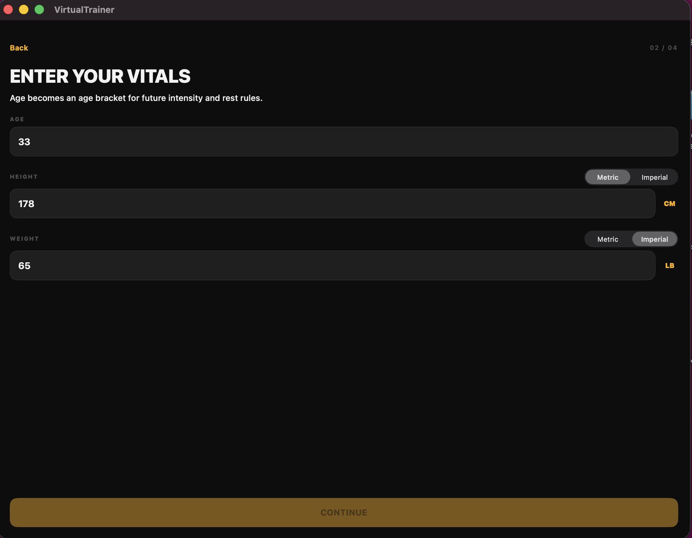

# Debug disabled Continue button

- Thread ID: 019df625-f257-7bb3-9cee-874f1e1e45c9
- Created: 2026-05-05 08:49:35 (Asia/Kolkata)
- Updated: 2026-05-05 09:03:15 (Asia/Kolkata)
- Archived: no
- Workspace: /Users/satvik.bansal/Desktop/VirtualTrainer - mediapipe
- Source rollout: /Users/satvik.bansal/.codex/sessions/2026/05/05/rollout-2026-05-05T08-49-35-019df625-f257-7bb3-9cee-874f1e1e45c9.jsonl
- Git branch at thread start: main
- Git SHA at thread start: 6f1ee83c979a7830bf6b822bb8109c0a0e2fa5fd
- Exported visible messages: 15
- Extracted input images: 1

## Conversation

### User - 2026-05-05 08:50:24

# Files mentioned by the user:

## Screenshot 2026-05-05 at 8.48.25 AM.png: /Users/satvik.bansal/Desktop/Screenshot 2026-05-05 at 8.48.25 AM.png

## My request for Codex:
hey  i reset my obaording from theprofile page and am now stuck in the Enter your Vitals page. Umable to click Continue. what is happening? can you deeply debug and tell me why we are stuck and resolve it? screenshot attached - despite entering all values, the continue button is disabled. what caused this? analyse all recent changes and implementation to deeply debug this

<image name=[Image #1]>

</image>

### Assistant - 2026-05-05 08:50:31

I’ll trace the onboarding/vitals flow from the UI state back through validation and reset behavior, then patch the root cause rather than just loosening the button. I’m going to inspect recent diffs first so we can connect this to what changed.

### Assistant - 2026-05-05 08:50:42

The key surface is in `OnboardingStore.canContinue(.stats)` and the reset path from `MainTabView`. I’ve found the vitals screen is driven by a computed validation flag, so next I’m reading the actual validation and recent commits around the onboarding/profile model.

### Assistant - 2026-05-05 08:50:58

I found a concrete mismatch in the screenshot: height is metric, but weight is currently set to `Imperial`, so `65` is being validated as 65 lb. The store’s validation rejects imperial weight below 66 lb, which is why the button is disabled even though the fields look filled; now I’m checking whether this came from a recent reset/default/unit implementation gap and adding guardrails so it can’t silently trap you again.

### Assistant - 2026-05-05 08:51:44

The Phase 1 onboarding commit introduced unit-specific ranges but no field-level reason for a disabled CTA. So the state in your screenshot is valid-looking to a human but invalid to the model: `weightUnit == .imperial` and `weight == 65`, just under the 66 lb minimum. I’m going to make unit switches convert the existing value instead of reinterpreting it, and surface the exact validation message on the vitals page.

### Assistant - 2026-05-05 08:52:32

I’m patching three small pieces: the store will expose the exact vitals validation messages, the unit segmented controls will route through conversion methods, and the tests will lock the `65 kg -> 143.3 lb` case plus the hidden `65 lb` invalid state.

### Assistant - 2026-05-05 08:53:16

The patch is in. It keeps the existing health bounds intact, but removes the sharp edge: unit changes now preserve meaning via conversion, and invalid values show why the CTA is still off instead of failing silently. I’m running the test/build path now because SwiftUI bindings and `@MainActor` tests are where little compile surprises like to hide.

### Assistant - 2026-05-05 08:53:40

The direct project test hit the known CocoaPods integration trap: it built the `.xcodeproj` and failed before my code with `No such module 'MediaPipeTasksVision'`. I’m switching to the workspace and an iOS Simulator destination, which is the path that should see the pod frameworks.

### Assistant - 2026-05-05 08:54:22

Workspace build has gotten past the MediaPipe module issue and is now in the simulator test phase. No compile errors from the onboarding changes so far, which is the important first gate.

### Assistant - 2026-05-05 08:55:07

The test runner is taking a while after installing the app on the simulator, which can happen on first boot. I’m letting it finish rather than killing it early, since the build completed and the remaining signal is whether the new unit tests pass.

### Assistant - 2026-05-05 08:56:37

Good news/bad news: the workspace build is healthy, and the new tests are the only failing area. That usually means the patch compiles but my test assumptions are slightly off, so I’m narrowing to just `OnboardingModelTests` to get the exact assertions.

### Assistant - 2026-05-05 08:59:28

The failures were from the `@MainActor` annotation on XCTest methods under this project’s test runner, not from assertions. I removed the explicit annotations because the target already builds with main-actor default isolation, then I’m rerunning the focused onboarding tests.

### Assistant - 2026-05-05 09:00:23

That confirmed the runner still needs main-actor access. I switched the tests to `async` and moved the store interactions inside `await MainActor.run`, which gives us actor-correct tests without the XCTest method-level crash.

### Assistant - 2026-05-05 09:01:24

Focused onboarding tests pass now, including the exact screenshot case and the conversion path. I’m running the full suite one more time so we know the fix didn’t disturb the rest of the app.

### Assistant - 2026-05-05 09:03:15

Fixed. The blocker was not the reset itself: in your screenshot, **Weight** is set to **Imperial**, so `65` was being validated as **65 lb**. The onboarding validator required imperial weight to be `66...550`, so `canContinue(.stats)` stayed false. The Phase 1 onboarding work added that hidden unit-specific range check, but the UI gave no reason and did not convert values when units changed.

I fixed it in [OnboardingStore.swift](</Users/satvik.bansal/Desktop/VirtualTrainer - mediapipe/VirtualTrainer/Models/OnboardingStore.swift:77>) and [OnboardingViews.swift](</Users/satvik.bansal/Desktop/VirtualTrainer - mediapipe/VirtualTrainer/UI/OnboardingViews.swift:167>):
- Vitals now show exact validation messages, e.g. “Weight must be between 66 and 550 lb.”
- Switching units now converts the current value instead of reinterpreting it, so `65 kg` becomes `143.3 lb`.
- Added tests for the exact stuck state and the conversion path in [OnboardingModelTests.swift](</Users/satvik.bansal/Desktop/VirtualTrainer - mediapipe/VirtualTrainerTests/OnboardingModelTests.swift:13>).

Verified with:
`xcodebuild test -workspace VirtualTrainer.xcworkspace -scheme VirtualTrainer -destination 'platform=iOS Simulator,name=iPhone 17,OS=26.2'`

Full suite passed. The fix is committed as `1d1226e Onboarding fixes`.

::git-commit{cwd="/Users/satvik.bansal/Desktop/VirtualTrainer - mediapipe"}
