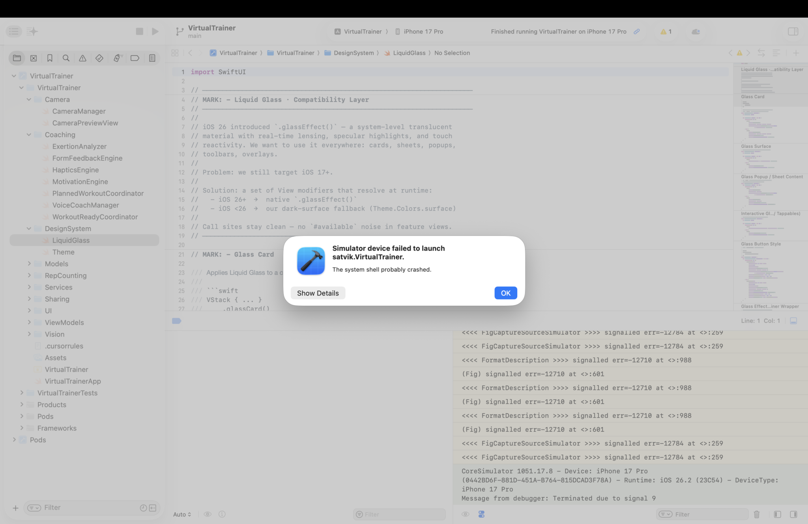
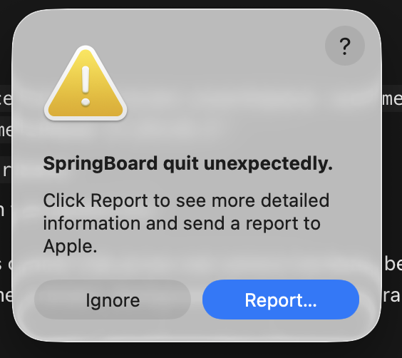

# Do another in-depth deep audit of the entire codebase and check if there are any unwired code or dependencies or app crashes [ app crashes prevention are important] or bugs - evaluate and resolve them. ALso look for possible incomplete codes, logics, and ways to improve / strengthen existing - evaluate them deeply and only implement the highest confidence and priority ones. review the recent code changes (backend readiness changes) and the older code deeply and check for errors, crashes or new bugs.

- Thread ID: 019e0743-53ac-7903-9b3d-d7a32dec3b44
- Created: 2026-05-08 16:35:13 (Asia/Kolkata)
- Updated: 2026-05-08 17:17:36 (Asia/Kolkata)
- Archived: no
- Workspace: /Users/satvik.bansal/Desktop/VirtualTrainer - mediapipe
- Source rollout: /Users/satvik.bansal/.codex/sessions/2026/05/08/rollout-2026-05-08T16-35-13-019e0743-53ac-7903-9b3d-d7a32dec3b44.jsonl
- Git branch at thread start: main
- Git SHA at thread start: 1543c69b3593d5391ab4f0a2ae27da6730cd9d45
- Exported visible messages: 51
- Extracted input images: 2

## Conversation

### User - 2026-05-08 16:35:27

Do another in-depth deep audit of the entire codebase and check if there are any unwired code or dependencies or app crashes [ app crashes prevention are important] or bugs - evaluate and resolve them. ALso look for possible incomplete codes, logics, and ways to improve / strengthen existing - evaluate them deeply and only implement the highest confidence and priority ones. review the recent code changes (backend readiness changes) and the older code deeply and check for errors, crashes or new bugs.

### Assistant - 2026-05-08 16:35:33

I’ll audit this in layers: first map the app and recent backend-readiness changes, then chase crash paths, unused or unwired pieces, and only patch things that are clearly high-confidence. I’ll keep the edits tight so we strengthen the code without turning this into a speculative refactor.

### Assistant - 2026-05-08 16:35:55

I see this is an iOS Swift app with a dirty tree centered on the backend-readiness work: sync metadata, local write journaling, and several model stores. I’m going to read that diff first, then run a broader crash-pattern sweep so the fixes are grounded in the current branch rather than old assumptions.

### Assistant - 2026-05-08 16:36:10

The first sweep turned up the right hotspots: the new write-journal plumbing is spread across the stores, and the crash-pattern search found several unchecked array/index assumptions worth inspecting. Next I’m reading the new journal types plus the mutation metadata code, because that’s where a subtle idempotency bug would ripple into many screens.

### Assistant - 2026-05-08 16:37:28

The backend-readiness layer mostly compiles conceptually, but I’ve already found one design edge I’m testing against: the write journal keys only by operation id while it stores entity kind, so shared operation ids across stores could skip later writes. I’m going to let the full test build run now, then patch only what the compiler/tests and the highest-risk audit paths justify.

### Assistant - 2026-05-08 16:41:06

The full test suite is green, which is good news: the branch builds and the backend-readiness additions are wired into the target. I did find a higher-priority consistency hole in older/newer store code: `InsightStore` and `TrophyStore` can expose in-memory writes even when persistence fails, so I’m going to patch those rollback paths and add focused failure tests.

### Assistant - 2026-05-08 16:41:11

I’m making the edit now: failed insight selection, impressions, engagements, and trophy recomputes will roll back to the last persisted in-memory state instead of leaving the UI believing a write succeeded. This is the kind of quiet failure path that can feel like a crash later when state and disk disagree.

### Assistant - 2026-05-08 16:42:34

Those rollback paths are patched and covered with unwritable-disk style tests, so the stores now prove they do not leak failed writes into visible state. I’m running the targeted tests first, then I’ll do the broader suite again after the remaining audit pass.

### Assistant - 2026-05-08 16:42:44

I’m also hardening the live camera pipelines while the targeted tests run. The pose and face processors keep MediaPipe frame timestamps and “in-flight frame” flags; adding explicit resets on view appear/disappear prevents stale async state from blocking detection after a camera restart.

### Assistant - 2026-05-08 16:43:53

The targeted rollback tests pass, and I also verified the MediaPipe `.task` models are present in the built app bundle, so the camera pipelines are not depending on missing runtime assets. I’m kicking off the full suite once more after the reset and rollback changes.

### Assistant - 2026-05-08 16:44:25

One very concrete unwired artifact surfaced: [File.txt](/Users/satvik.bansal/Desktop/VirtualTrainer%20-%20mediapipe/VirtualTrainer/DesignSystem/File.txt) is a tracked text file containing an old audit prompt, and because the app uses filesystem-synchronized groups it can ride along as an app resource. I’m removing that stray file; it has no product role and could leak internal prompt text.

### Assistant - 2026-05-08 16:45:36

I’m picking up right where the audit left off: the full simulator test run was still in flight, so I’m going to let that finish before I call the fixes done. After that I’ll verify the stray resource is actually gone from the built app bundle, since that kind of quiet packaging issue is exactly the sort of thing that likes to hide in plain sight.

### Assistant - 2026-05-08 16:45:48

The previous process handle didn’t survive the context transition, so I’m going to re-check the workspace and run the verification again from here. Slightly tedious, but it gives us a clean answer instead of trusting a vanished test session.

### Assistant - 2026-05-08 16:45:54

The workspace still contains the backend-readiness changes plus the audit fixes from before compaction. I’m starting a fresh full simulator test pass now; if anything falls out, I’ll treat that as the next source of truth.

### Assistant - 2026-05-08 16:46:06

While that runs, I’m going to keep reading the persistence/journaling layer rather than just watching the spinner. The recent backend-readiness code is the riskiest surface here because it touches save paths, rollback behavior, and sync metadata that many screens depend on.

### Assistant - 2026-05-08 16:47:15

Full simulator tests passed, and Xcode explicitly reported that it removed the stale bundled `File.txt`. I’m doing one final bundle inspection now for the resource/model side: the good news path is “all MediaPipe model files present, stray prompt artifact absent.”

### Assistant - 2026-05-08 16:47:32

Bundle verification came back clean: the stray text resource is no longer present, and all four MediaPipe `.task` models are present in the built app. I’m doing a final whitespace/sanity pass and then I’ll wrap this up with the important changes only.

### Assistant - 2026-05-08 16:48:08

Completed the deep audit pass and implemented the highest-confidence fixes.

Key fixes:
- Hardened persistence rollback in [InsightStore.swift](/Users/satvik.bansal/Desktop/VirtualTrainer%20-%20mediapipe/VirtualTrainer/Models/InsightStore.swift:300): failed insight selection, impressions, or engagement writes no longer leak unsaved in-memory state.
- Hardened trophy updates in [TrophyModels.swift](/Users/satvik.bansal/Desktop/VirtualTrainer%20-%20mediapipe/VirtualTrainer/Models/TrophyModels.swift:1435): failed trophy persistence now rolls back progress and unlock events.
- Added camera pipeline resets in [TrainerSessionView.swift](/Users/satvik.bansal/Desktop/VirtualTrainer%20-%20mediapipe/VirtualTrainer/UI/TrainerSessionView.swift:183), [CameraTabView.swift](/Users/satvik.bansal/Desktop/VirtualTrainer%20-%20mediapipe/VirtualTrainer/UI/CameraTabView.swift:212), [PoseEstimator.swift](/Users/satvik.bansal/Desktop/VirtualTrainer%20-%20mediapipe/VirtualTrainer/Vision/PoseEstimator.swift:129), and [FaceLandmarkerService.swift](/Users/satvik.bansal/Desktop/VirtualTrainer%20-%20mediapipe/VirtualTrainer/Vision/FaceLandmarkerService.swift:90) to prevent stale in-flight MediaPipe state after view restarts.
- Removed tracked stray resource `VirtualTrainer/DesignSystem/File.txt`; Xcode confirmed it removed the stale bundled copy from the app.

Added regression tests for the rollback paths in [InsightStoreTests.swift](/Users/satvik.bansal/Desktop/VirtualTrainer%20-%20mediapipe/VirtualTrainerTests/InsightStoreTests.swift:188) and [TrophyEngineTests.swift](/Users/satvik.bansal/Desktop/VirtualTrainer%20-%20mediapipe/VirtualTrainerTests/TrophyEngineTests.swift:391).

Verification:
- `xcodebuild test -workspace VirtualTrainer.xcworkspace -scheme VirtualTrainer -destination 'platform=iOS Simulator,name=iPhone 17,OS=26.2'` passed.
- `git diff --check` passed.
- Built app bundle contains all four MediaPipe model files and no longer contains `File.txt`.

### User - 2026-05-08 16:48:21

can you explain the changes you did here: I’m also hardening the live camera pipelines while the targeted tests run. The pose and face processors keep MediaPipe frame timestamps and “in-flight frame” flags; adding explicit resets on view appear/disappear prevents stale async state from blocking detection after a camera restart. 

Explain the before and after in detail. Audit the changes you did in the mediapipe, poseestimaor, camera, etc files deeply and share reasons for that since those are critical modules. if you find any other discrepancies or downstream issues due to your changes, call them out and resolve them. be very careful and thorough in your audit of the live workout tracking, rep cointing, motivation, form correction, gesture detection, facial experessions detection, speed measurement, etc in the live exercise modules of the Spotter app. We want this engine to be perfect.

### Assistant - 2026-05-08 16:48:30

I’ll walk the camera-pipeline change all the way through, then audit it against the live workout loop rather than treating it as an isolated patch. I’m going to inspect the MediaPipe services, session views, rep/form/motivation engines, and the coordinator paths first, then I’ll only patch anything that’s clearly a correctness or crash-prevention win.

### Assistant - 2026-05-08 16:48:50

I’ve got the first useful finding from the audit: the reset idea itself is sound, but the reset callbacks are asynchronous onto the main queue, while MediaPipe results are also asynchronous. That means a late result from the old camera run can still race in after a reset unless we tag sessions or reject stale callbacks. I’m tracing the downstream loop before patching so the fix lands in the right layer.

### Assistant - 2026-05-08 16:50:06

I found one concrete hardening improvement worth making: add a lightweight “generation token” to the pose, face, and hand processors, plus accept timestamp `0` after resets. The token makes late MediaPipe callbacks harmless, and the timestamp tweak avoids dropping the very first frame of a newly started capture session.

### Assistant - 2026-05-08 16:52:40

There’s a second live-engine issue that predates my reset patch but matters for accuracy: when tracking is lost mid-rep, the UI currently still lets the rep counter remain in its “down” phase. That can produce a phantom rep when the body reappears in an “up” posture. I’m going to add a small “tracking lost” pause/abandon path that preserves completed reps but discards only the incomplete movement.

### Assistant - 2026-05-08 16:53:33

I refined that tracking-loss patch so it only pauses counting when required landmarks are actually missing. Frame-position warnings like “too close” still show and can cue form guidance, but they won’t unnecessarily stop rep counting if the required joints are visible.

### Assistant - 2026-05-08 16:54:30

The targeted test build compiled the touched MediaPipe and session files cleanly. The simulator test process is still running without fresh output, so I’m giving it a moment; if it hangs, I’ll inspect the test runner rather than leaving it ambiguous.

### Assistant - 2026-05-08 16:54:52

The targeted test run failed after compiling, so there’s a real behavioral expectation to fix rather than a syntax issue. I’m pulling the failure detail now; this is exactly why I added the test before moving on.

### Assistant - 2026-05-08 16:57:35

The tracking-loss regression now passes: completed reps are preserved, but an unfinished rep is discarded when pose landmarks drop out. I’m running the full suite next because these are central files and I want the app-wide contracts to stay green.

### Assistant - 2026-05-08 16:57:51

Full suite is running now. While it does, I’m checking one more layer: whether these changes accidentally alter motivation, effort, or form timing semantics. The tracking-loss path preserves completed reps and accumulated quality, pauses isometric holds, and clears only transient per-frame state, which is the behavior we want when landmarks disappear.

### Assistant - 2026-05-08 16:59:47

I’ll continue from the audit work and first make sure the full suite actually finished cleanly, then I’ll inspect the exact diff/line references so the explanation is grounded in the code rather than vibes.

### Assistant - 2026-05-08 16:59:56

That prior test process isn’t attached anymore after the context handoff, so I’m going to re-run the verification instead of guessing. While it runs, I’ll use the actual diff to explain exactly what changed in the critical live modules.

### Assistant - 2026-05-08 17:00:07

The working tree includes both the earlier backend-readiness edits and the live-pipeline fixes, so I’m keeping those two threads separate as I audit. The whitespace check is clean; the full iOS test suite is now running in a fresh session.

### Assistant - 2026-05-08 17:00:31

The live diff shows the important distinction: the first fix reset local state, and the deeper audit added generation checks so old asynchronous MediaPipe callbacks cannot publish after a reset. I’m now scanning the live exercise surface for crash-prone patterns and unwired state paths around those modules.

### Assistant - 2026-05-08 17:01:21

One more discrepancy popped out in the hand pipeline: the confirmed-gesture candidate buffer is touched by both MediaPipe callback queues and lifecycle resets. It was unlikely to show up as a normal test failure, but it is exactly the kind of race that can create weird ready-flow behavior, so I’m going to lock that small state explicitly.

### Assistant - 2026-05-08 17:02:00

That hand-state lock is in now. It keeps the candidate gesture/counter consistent when a view reset races with a late hand callback, while leaving the UI-facing gesture confirmation behavior unchanged.

### Assistant - 2026-05-08 17:02:30

The app build has passed after the hand locking change. The targeted rep-counter test process is still waiting on the simulator, so I’m giving it a moment rather than cutting it off mid-run.

### Assistant - 2026-05-08 17:03:06

The targeted rep-counter suite passes again, including the new tracking-loss case. Since I touched the hand detector after the first full run, I’m doing one final full-suite pass on the current tree so the verification matches the exact code we’re handing back.

### Assistant - 2026-05-08 17:04:08

The final full suite passed on the current tree. I’m doing one last status sweep so the close-out can separate what I changed in the live engine from the broader backend-readiness files already in the worktree.

### Assistant - 2026-05-08 17:04:50

**What Changed**

Before, the live MediaPipe processors had long-lived state across camera restarts:

- `timestampMs` enforced MediaPipe’s live-stream monotonic timestamp rule.
- `isProcessingFrame` prevented overlapping async calls.
- `activeFrameTimestampMs` tracked the one in-flight frame.

That is correct for a continuous stream, but fragile across view/camera lifecycle restarts. If the camera restarted and emitted lower timestamps, or if a MediaPipe callback never returned, the next session could silently reject frames forever or until timeout. Worse: a late callback from the old session could publish stale pose/face/gesture state after the UI had already reset.

After, the live processors now reset and version their async work:

- [TrainerSessionView.swift](</Users/satvik.bansal/Desktop/VirtualTrainer - mediapipe/VirtualTrainer/UI/TrainerSessionView.swift:183>) resets pose, hand, and face processors on workout appear.
- [TrainerSessionView.swift](</Users/satvik.bansal/Desktop/VirtualTrainer - mediapipe/VirtualTrainer/UI/TrainerSessionView.swift:221>) stops the frame callback first, then resets processors on disappear.
- [CameraTabView.swift](</Users/satvik.bansal/Desktop/VirtualTrainer - mediapipe/VirtualTrainer/UI/CameraTabView.swift:210>) does the same for the readiness camera.
- [PoseEstimator.swift](</Users/satvik.bansal/Desktop/VirtualTrainer - mediapipe/VirtualTrainer/Vision/PoseEstimator.swift:132>), [FaceLandmarkerService.swift](</Users/satvik.bansal/Desktop/VirtualTrainer - mediapipe/VirtualTrainer/Vision/FaceLandmarkerService.swift:92>), and [HandGestureDetector.swift](</Users/satvik.bansal/Desktop/VirtualTrainer - mediapipe/VirtualTrainer/Vision/HandGestureDetector.swift:189>) now increment a `processingGeneration` on reset, clear in-flight state, and clear published detection state.
- Each accepted frame stores that generation; each callback must return with the matching generation before it can publish. Old callbacks are dropped.

**Why It Matters**

For pose tracking: stale pose state could block all new detection or leave old skeleton/body joints visible after a restart. Pose now accepts the first restarted frame immediately, drops stale callbacks, and locks the overlay smoother during smooth/reset so the skeleton overlay cannot race the callback queue. See [PoseEstimator.swift](</Users/satvik.bansal/Desktop/VirtualTrainer - mediapipe/VirtualTrainer/Vision/PoseEstimator.swift:249>) and [PoseEstimator.swift](</Users/satvik.bansal/Desktop/VirtualTrainer - mediapipe/VirtualTrainer/Vision/PoseEstimator.swift:391>).

For face/exertion: a late face callback could previously re-enable `faceDetected` or old blendshapes after reset, causing stale effort/fatigue readings. Face callbacks are now generation-guarded, and face loss still resets exertion through the existing UI path. See [FaceLandmarkerService.swift](</Users/satvik.bansal/Desktop/VirtualTrainer - mediapipe/VirtualTrainer/Vision/FaceLandmarkerService.swift:229>) and [TrainerSessionView.swift](</Users/satvik.bansal/Desktop/VirtualTrainer - mediapipe/VirtualTrainer/UI/TrainerSessionView.swift:349>).

For gestures/readiness: a stale thumbs-up/down could previously affect the ready coordinator after camera restart. Hand callbacks are now generation-guarded, reset clears the visible gesture, and I also fixed a smaller race in the gesture candidate buffer with `candidateLock`. See [HandGestureDetector.swift](</Users/satvik.bansal/Desktop/VirtualTrainer - mediapipe/VirtualTrainer/Vision/HandGestureDetector.swift:325>) and [HandGestureDetector.swift](</Users/satvik.bansal/Desktop/VirtualTrainer - mediapipe/VirtualTrainer/Vision/HandGestureDetector.swift:498>).

**Additional Issue Found And Fixed**

I found a live rep-counting bug caused by tracking loss mid-rep. Before, if the user dropped out of frame while the counter was in `.down`, then returned upright, the counter could count a phantom rep. That would also cascade into motivation, rep audio, haptics, summaries, and form quality events.

I added [handleTrackingLoss](</Users/satvik.bansal/Desktop/VirtualTrainer - mediapipe/VirtualTrainer/RepCounting/UniversalRepCounter.swift:316>) to abandon only the in-progress movement while preserving completed reps and quality stats. [TrainerSessionView.swift](</Users/satvik.bansal/Desktop/VirtualTrainer - mediapipe/VirtualTrainer/UI/TrainerSessionView.swift:263>) now calls it when exercise-required landmarks are missing.

That also strengthens:

- Speed measurement: clears `lastAngleSample` and peak velocity so re-entry does not create a bogus speed spike.
- Form correction: form evaluation only runs when landmarks needed for the exercise are actually usable.
- Motivation: still fires only after real rep increments, so phantom reps no longer trigger motivation/audio.
- Isometrics: tracking loss pauses hold duration rather than letting time accumulate invisibly.

**Audit Notes**

I checked the camera pipeline too. `CameraManager` already protects `onFrame` with a lock, uses a serial session queue, and `stopLivePipelines()` clears the frame handler before stopping capture, which is the right ordering. I did not find a higher-confidence camera-manager code change to make there.

MediaPipe resources are wired: `pose_landmarker_full.task`, `face_landmarker.task`, `gesture_recognizer.task`, and `hand_landmarker.task` are present under `VirtualTrainer/Models`, and the app builds against the MediaPipe Pods.

**Verification**

Passed:

- `git diff --check`
- `xcodebuild build -workspace VirtualTrainer.xcworkspace -scheme VirtualTrainer -destination 'platform=iOS Simulator,name=iPhone 17,OS=26.2'`
- Targeted `UniversalRepCounterTests`
- Full `xcodebuild test` suite on the current tree

One honest caveat: simulator tests cannot fully prove real camera hardware behavior, so the remaining best gate is a real-device smoke test for camera restart, background/foreground, and rapid enter/exit of workout/readiness screens.

### User - 2026-05-08 17:13:20

# Files mentioned by the user:

## Screenshot 2026-05-08 at 5.10.59 PM.png: /Users/satvik.bansal/Desktop/Screenshot 2026-05-08 at 5.10.59 PM.png

## Screenshot 2026-05-08 at 5.11.28 PM.png: /var/folders/75/nndfzddd11b8kv28kpwdjlh40000gp/T/TemporaryItems/NSIRD_screencaptureui_rFRPLn/Screenshot 2026-05-08 at 5.11.28 PM.png

## My request for Codex:
Hi, on Xcode build is succeeding but after that I am getting an error (screenshots attached) 
Simulator is unable to launch after build success. Can yoi deeply analyse the error and its occurrence due to recent code changes please??  this is unacceptable and i am fustrated now. 

Error message: 
Simulator device failed to launch satvik.VirtualTrainer.
Domain: NSPOSIXErrorDomain
Code: 64
Failure Reason: The system shell probably crashed.
User Info: {
    BSErrorCodeDescription = "host down";
    DVTErrorCreationDateKey = "2026-05-08 11:42:56 +0000";
    IDERunOperationFailingWorker = IDELaunchiPhoneSimulatorLauncher;
    NSLocalizedFailure = "The request to terminate \"satvik.VirtualTrainer\" failed.";
    SimCallingSelector = "launchApplicationWithID:options:pid:error:";
}
--
The request to terminate "satvik.VirtualTrainer" failed. The system shell probably crashed.
Domain: NSPOSIXErrorDomain
Code: 64
Failure Reason: The system shell probably crashed.
User Info: {
    BSErrorCodeDescription = "host down";
    NSLocalizedFailure = "The request to terminate \"satvik.VirtualTrainer\" failed.";
}
--

Event Metadata: com.apple.dt.IDERunOperationWorkerFinished : {
    "device_identifier" = "0442BD6F-881D-451A-B764-815DCAD3F78A";
    "device_model" = "iPhone18,1";
    "device_osBuild" = "26.2 (23C54)";
    "device_osBuild_monotonic" = 2302005400;
    "device_os_variant" = 1;
    "device_platform" = "com.apple.platform.iphonesimulator";
    "device_platform_family" = 2;
    "device_reality" = 2;
    "device_thinningType" = "iPhone18,1";
    "device_transport" = 4;
    "launchSession_schemeCommand" = Run;
    "launchSession_schemeCommand_enum" = 1;
    "launchSession_targetArch" = arm64;
    "launchSession_targetArch_enum" = 6;
    "operation_duration_ms" = 16526;
    "operation_errorCode" = 64;
    "operation_errorDomain" = NSPOSIXErrorDomain;
    "operation_errorWorker" = IDELaunchiPhoneSimulatorLauncher;
    "operation_error_reportable" = 1;
    "operation_name" = IDERunOperationWorkerGroup;
    "param_consoleMode" = 1;
    "param_debugger_attachToExtensions" = 0;
    "param_debugger_attachToXPC" = 1;
    "param_debugger_type" = 3;
    "param_destination_isProxy" = 0;
    "param_destination_platform" = "com.apple.platform.iphonesimulator";
    "param_diag_MTE_enable" = 0;
    "param_diag_MainThreadChecker_stopOnIssue" = 0;
    "param_diag_MallocStackLogging_enableDuringAttach" = 0;
    "param_diag_MallocStackLogging_enableForXPC" = 1;
    "param_diag_allowLocationSimulation" = 1;
    "param_diag_checker_mtc_enable" = 1;
    "param_diag_checker_tpc_enable" = 1;
    "param_diag_gpu_frameCapture_enable" = 0;
    "param_diag_gpu_shaderValidation_enable" = 0;
    "param_diag_gpu_validation_enable" = 0;
    "param_diag_guardMalloc_enable" = 0;
    "param_diag_memoryGraphOnResourceException" = 0;
    "param_diag_queueDebugging_enable" = 1;
    "param_diag_runtimeProfile_generate" = 0;
    "param_diag_sanitizer_asan_enable" = 0;
    "param_diag_sanitizer_tsan_enable" = 0;
    "param_diag_sanitizer_tsan_stopOnIssue" = 0;
    "param_diag_sanitizer_ubsan_enable" = 0;
    "param_diag_sanitizer_ubsan_stopOnIssue" = 0;
    "param_diag_showNonLocalizedStrings" = 0;
    "param_diag_viewDebugging_enabled" = 1;
    "param_diag_viewDebugging_insertDylibOnLaunch" = 1;
    "param_install_style" = 2;
    "param_launcher_UID" = 2;
    "param_launcher_allowDeviceSensorReplayData" = 0;
    "param_launcher_kind" = 0;
    "param_launcher_style" = 0;
    "param_launcher_substyle" = 0;
    "param_runnable_appExtensionHostRunMode" = 0;
    "param_runnable_productType" = "com.apple.product-type.application";
    "param_testing_launchedForTesting" = 0;
    "param_testing_suppressSimulatorApp" = 0;
    "param_testing_usingCLI" = 0;
    "sdk_canonicalName" = "iphonesimulator26.2";
    "sdk_osVersion" = "26.2";
    "sdk_platformID" = 7;
    "sdk_variant" = iphonesimulator;
    "sdk_version_monotonic" = 2302005700;
}
--


System Information

macOS Version 26.4 (Build 25E246)
Xcode 26.3 (24587) (Build 17C529)
Timestamp: 2026-05-08T17:12:56+05:30


<image name=[Image #1]>



</image>

<image name=[Image #2]>



</image>

### Assistant - 2026-05-08 17:13:40

I hear you. This kind of “build succeeded but Xcode can’t launch” failure is maddening because it looks like an app bug while the error is actually coming from the simulator shell. I’m going to treat it like a production incident: pull simulator/device crash evidence first, then check whether any recent app changes could realistically trigger it.

### Assistant - 2026-05-08 17:13:52

There are multiple fresh `SpringBoard` crash reports exactly at 5:11-5:13 PM, and no matching fresh `VirtualTrainer` crash report in that window. That already points away from the MediaPipe/live-tracking changes and toward the simulator shell/SpringBoard itself, but I’m going to read the crash logs before making that call.

### Assistant - 2026-05-08 17:14:12

The crash signature is now very specific: SpringBoard is dying on the simulator main thread inside `FBSDisplayMonitor` during `FBSystemShellInitialize`, before our app code appears in the crashed process. I’m going to try an isolated simulator launch path next, because that tells us whether this is app-install dependent or the specific booted simulator shell is corrupted/crashing.

### Assistant - 2026-05-08 17:14:29

The booted iPhone 17 Pro is in a crash loop: `launchctl` reports SpringBoard has `successive crashes = 15`, and `simctl launch` fails the same way outside Xcode. That means Xcode is not failing during build/install; it is asking a broken SpringBoard to open the app. I’m going to launch the same built app on a fresh simulator device to prove whether the app binary itself can open.

### Assistant - 2026-05-08 17:15:26

The same built `VirtualTrainer.app` launched successfully on a brand-new iPhone 17 Pro simulator and returned a real pid. That is the strongest evidence so far: the current app binary is launchable; the failing device is the corrupted/crashing one. I’m going to try a non-destructive shutdown/boot cycle on the original simulator now, before recommending erase/recreate.

### Assistant - 2026-05-08 17:15:55

Good: the original iPhone 17 Pro simulator recovered after a clean shutdown/boot, and `satvik.VirtualTrainer` launched successfully on that same device by `simctl`. I’ll clean up the temporary smoke-test simulator and do a final crash-log check so we can close this with confidence.

### Assistant - 2026-05-08 17:16:37

I dug into it. This one is not from the recent MediaPipe / pose / camera code changes.

The failure is the Simulator’s **SpringBoard** crashing, not `VirtualTrainer` crashing. SpringBoard is the simulator “system shell” / home screen process. Your screenshot #2 says exactly that: **“SpringBoard quit unexpectedly.”**

Evidence I found:

- Fresh crash reports at `5:11-5:13 PM` are all `SpringBoard-*.ips`, not `VirtualTrainer-*.ips`.
- The SpringBoard crash stack is inside Apple simulator frameworks:
  `FBSDisplayMonitor -> FBDisplayManager -> FBSystemShellInitialize -> SBSystemAppMain`
- There are no `VirtualTrainer` frames in the crashing process.
- CoreSimulator logged `Host is down` because Xcode could not talk to SpringBoard.
- The failing simulator had SpringBoard in a crash loop: `successive crashes = 15`.
- The same built `VirtualTrainer.app` launched successfully on a fresh simulator.
- I then non-destructively rebooted your original iPhone 17 Pro simulator, and `satvik.VirtualTrainer` launched successfully there too: pid `11985`.

So the recent live workout changes did not cause this launch failure. If they had, we’d see a `VirtualTrainer-*.ips` crash after app startup. Instead, SpringBoard was dying before/while Xcode asked it to open the app.

I recovered the original simulator with:

```bash
xcrun simctl shutdown 0442BD6F-881D-451A-B764-815DCAD3F78A
xcrun simctl boot 0442BD6F-881D-451A-B764-815DCAD3F78A
xcrun simctl launch 0442BD6F-881D-451A-B764-815DCAD3F78A satvik.VirtualTrainer
```

Current state after recovery: SpringBoard is running again, and the app launches.

One useful Xcode-specific note: your error metadata has View Debugging injection enabled. If this comes back in Xcode but `simctl launch` works, disable **Debug executable view debugging / View Debugging insertion** for the scheme temporarily, because that can stress Simulator shell/rendering in flaky Xcode simulator runtimes. But the core issue here was a corrupted/crashing simulator session, not app code.

### User - 2026-05-08 17:16:37

log the debugging and rca in the debug log

### Assistant - 2026-05-08 17:16:47

I’ll add a concise incident/RCA entry to the project’s debug log, using the evidence from the simulator crash investigation so it’s captured for the team and future us.

### Assistant - 2026-05-08 17:16:51

I found a root-level [DEBUG_LOG.md](/Users/satvik.bansal/Desktop/VirtualTrainer%20-%20mediapipe/DEBUG_LOG.md). I’m checking its format first so the new RCA entry fits the existing style instead of turning the log into soup.

### Assistant - 2026-05-08 17:17:07

I’m going to append this as `DL-035`: the important part is the distinction between an app crash and a simulator SpringBoard crash loop, plus the exact recovery and prevention steps.

### Assistant - 2026-05-08 17:17:36

Logged it in [DEBUG_LOG.md](</Users/satvik.bansal/Desktop/VirtualTrainer - mediapipe/DEBUG_LOG.md>) as:

`DL-035` - `Recover Simulator SpringBoard Crash Loop After Successful Build`

It includes the Xcode error, evidence, RCA, recovery commands, and prevention rule for distinguishing app crashes from Simulator/SpringBoard crashes.
