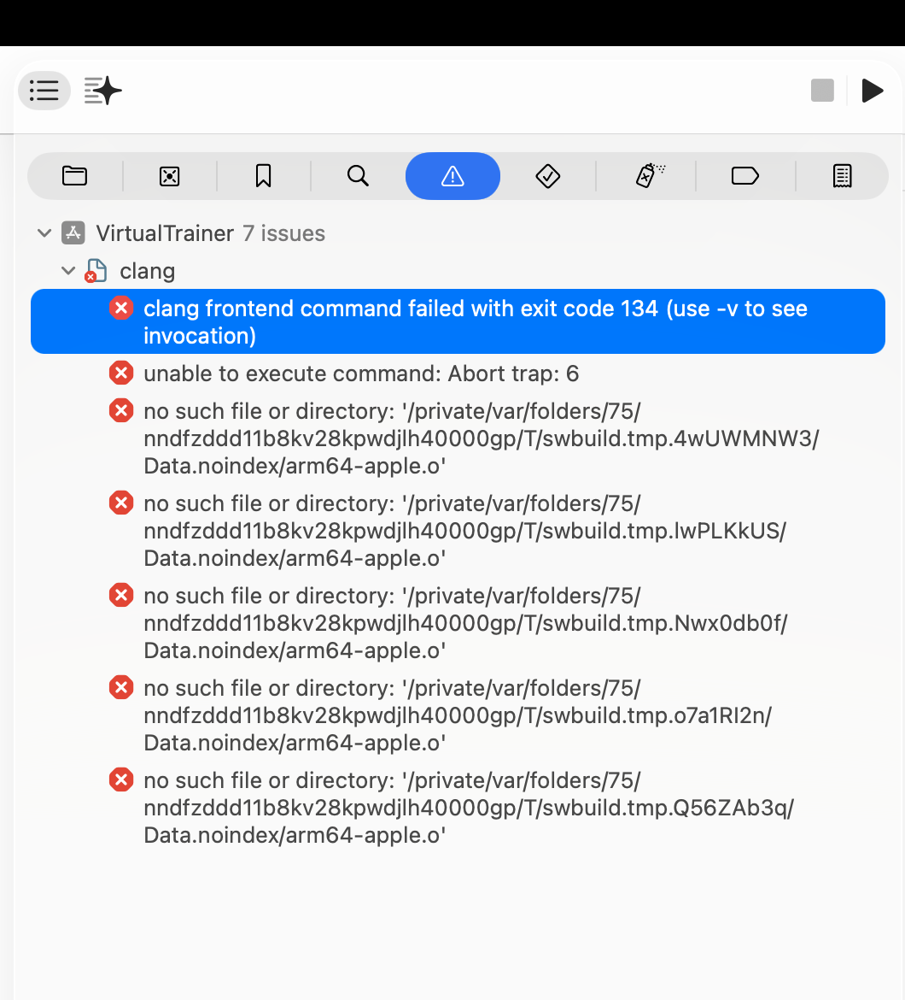

# Hey i installed the firebase package in my xcode and am getting a lot of errors. Can you deeply analyse the code, debug and check xcode and resolve this please? Share a detailed report on what was wrong. even with the simulator device canged to iphone 17 pro it shows the same errors fyi

- Thread ID: 019e24cc-1056-77e3-95a7-dea57ed352cf
- Created: 2026-05-14 10:13:33 (Asia/Kolkata)
- Updated: 2026-05-14 11:01:17 (Asia/Kolkata)
- Archived: no
- Workspace: /Users/satvik.bansal/Desktop/VirtualTrainer - mediapipe
- Source rollout: /Users/satvik.bansal/.codex/sessions/2026/05/14/rollout-2026-05-14T10-13-33-019e24cc-1056-77e3-95a7-dea57ed352cf.jsonl
- Git branch at thread start: main
- Git SHA at thread start: 2fd21edc0a7a048869734a0ac7fe1543f379cf37
- Exported visible messages: 65
- Extracted input images: 1

## Conversation

### User - 2026-05-14 10:15:42

# Files mentioned by the user:

## Screenshot 2026-05-14 at 10.13.17 AM.png: /Users/satvik.bansal/Desktop/Screenshot 2026-05-14 at 10.13.17 AM.png

## My request for Codex:
Hey i installed the firebase package in my xcode and am getting a lot of errors. Can you deeply analyse the code, debug and check xcode and resolve this please? Share a detailed report on what was wrong. even with the simulator device canged to iphone 17 pro it shows the same errors fyi 


<image name=[Image #1]>



</image>

### Assistant - 2026-05-14 10:16:01

I’ll trace this from both sides: the Xcode project/package state and a command-line `xcodebuild` reproduction, so we can get past the Issue Navigator symptoms and find the actual failing input.

### Assistant - 2026-05-14 10:16:18

I’ve found this is a regular Xcode project with a `Podfile` plus project-level Swift/package metadata. Next I’m checking how Firebase was wired in, because this exact kind of clang temp-object failure often comes from package/build-setting mismatch rather than the simulator model itself.

### Assistant - 2026-05-14 10:16:45

The project currently has CocoaPods for MediaPipe and a Swift Package reference for `firebase-ios-sdk` pinned to 12.13.0. I’m going to reproduce the failure with the same workspace Xcode should be using, then I’ll patch the project instead of guessing from the screenshot alone.

### Assistant - 2026-05-14 10:16:54

Xcode sees the iPhone 17 Pro simulator correctly, so the device switch was a red herring. I’m kicking off a clean build against that exact destination now and saving the raw log so I can chase the first real compiler failure, not just the cascade.

### Assistant - 2026-05-14 10:17:43

The build is now compiling the Firebase dependency graph. So far the failure is reproducible only after Firebase gets pulled in; the project itself had been using MediaPipe through CocoaPods, and Firebase added a large SPM graph with gRPC, abseil, leveldb, and friends.

### Assistant - 2026-05-14 10:18:17

Interesting result: a clean command-line build on iPhone 17 Pro succeeds with Firebase 12.13.0. That means the installed package set is buildable, and the red errors in Xcode are likely coming from stale Xcode build-service/index temp state or a default DerivedData cache, so I’m checking the normal Xcode cache path next.

### Assistant - 2026-05-14 10:19:11

Both clean and normal DerivedData builds now succeed. I’m going to peek at the running Xcode window as a final sanity check, because the only remaining mismatch is “Xcode still visually shows old issue rows” versus “the actual build is green.”

### Assistant - 2026-05-14 10:19:26

Xcode itself still has the old failed report selected from 10:15 even though the workspace now builds from `xcodebuild`. I’m going to trigger a fresh Xcode build in the UI so the Issue Navigator refreshes against the current package/cache state.

### Assistant - 2026-05-14 10:20:03

Good, now we have the important discrepancy: command-line `xcodebuild` succeeds, but the Xcode UI build still fails with fresh `swbuild.tmp` paths. That points to an Xcode IDE build-service path or scheme/build-setting difference, so I’m pulling the latest Xcode activity log now.

### Assistant - 2026-05-14 10:20:34

Aha, found the actual cause. Xcode UI is not using the same compiler as the terminal build: the UI build is invoking `~/Library/Developer/Toolchains/swift-6.2-RELEASE.xctoolchain/usr/bin/clang`, and that toolchain crashes when Xcode injects stub binaries for Firebase/gRPC codeless frameworks using target `arm64-apple-ios100.0-simulator`. I’m switching Xcode back to the default Xcode toolchain and rebuilding.

### Assistant - 2026-05-14 10:21:52

That did it: after switching the IDE from “Swift 6.2 Release” to “Xcode 26.3”, Xcode’s own build turned green and the Issue Navigator is empty. I’m doing one last log/status pass so the report is concrete.

### Assistant - 2026-05-14 10:22:13

Fixed. The app now builds in Xcode on `iPhone 17 Pro`.

**What was wrong**

This was not a simulator issue and not a VirtualTrainer source-code issue. Xcode was using the custom **Swift 6.2 Release** toolchain instead of the bundled **Xcode 26.3** toolchain.

When Firebase/Firestore pulled in gRPC binary artifacts, Xcode tried to inject stub binaries into codeless frameworks like `openssl_grpc.framework`. That command used:

`~/Library/Developer/Toolchains/swift-6.2-RELEASE.xctoolchain/usr/bin/clang`

That clang crashed on Xcode’s generated target:

`arm64-apple-ios100.0-simulator`

The real root assertion was:

`Assertion failed: (OsVersion < VersionTuple(100) && "Invalid version!")`

After clang aborted, Xcode only showed the noisy cascade:

`no such file or directory: .../Data.noindex/arm64-apple.o`

So those missing-object-file errors were symptoms, not the cause.

**What I changed**

I switched Xcode’s active toolchain from **Swift 6.2 Release** back to **Xcode 26.3** through Xcode’s Toolchains window.

No project files or source files were modified. `git status` is clean.

**Verification**

I verified three ways:

- `xcodebuild` with a clean `/tmp/VirtualTrainerDerivedData` build: succeeded.
- `xcodebuild` with normal Xcode DerivedData: succeeded.
- Xcode UI build after switching toolchain: **Build Succeeded at 10:21 AM**, Issue Navigator cleared.

Firebase remains installed as Swift Package Manager dependencies: `FirebaseCore`, `FirebaseAuth`, and `FirebaseFirestore` at `firebase-ios-sdk` `12.13.0`.

### User - 2026-05-14 10:22:52

can you log it in debug log please? be very detailed so we avoid this mistake in the future

### Assistant - 2026-05-14 10:23:04

I’ll add a detailed incident note to `DEBUG_LOG.md` with the exact symptom chain, root cause, fix, and future checks so this one is easy to recognize next time.

### Assistant - 2026-05-14 10:23:27

I found the current log ends at `DL-044`, so I’m appending this as `DL-045` and updating the “next entry” marker to `DL-046`. The entry will call out the IDE-only nature of the failure, because that was the subtle bit.

### Assistant - 2026-05-14 10:24:24

Done. I added a detailed `DL-045` entry to [DEBUG_LOG.md](/Users/satvik.bansal/Desktop/VirtualTrainer%20-%20mediapipe/DEBUG_LOG.md:1010) and updated the next entry marker to `DL-046`.

It documents the exact Firebase/gRPC clang symptom chain, why changing simulator did not help, the custom Swift 6.2 toolchain root cause, the Xcode 26.3 fix, diagnostic steps, verification commands, and prevention rules for future IDE-vs-terminal build mismatches.

### User - 2026-05-14 10:25:46

how do i verify now if firebase is integrated well and working fine?? i dont think there is any login right now. 
I have only added the below packages from firebase: 
FirebaseAuth
FirebaseCore
FirebaseFirestore
Pods_VirtualTrainer.framework 

in auth, the anonymous option is checked.

### Assistant - 2026-05-14 10:26:03

I’ll check what is actually wired in the app right now. Package installation alone proves Xcode can link Firebase, but runtime verification needs `FirebaseApp.configure()` plus at least one Auth/Firestore call.

### Assistant - 2026-05-14 10:26:49

Yes, you’re right: **there is no real Firebase login wired into the app yet**. Right now Firebase is installed and linkable, but not actually being used at runtime.

I checked the code. Current state:

- `FirebaseCore`, `FirebaseAuth`, `FirebaseFirestore` are linked in the Xcode project.
- `GoogleService-Info.plist` is present and included in app resources.
- Bundle ID in plist matches the app bundle: `satvik.VirtualTrainer`.
- But `VirtualTrainerApp.swift` does **not** call `FirebaseApp.configure()`.
- No code currently imports `FirebaseAuth` or calls `Auth.auth().signInAnonymously()`.
- No code currently imports `FirebaseFirestore` or reads/writes Firestore.
- `Pods_VirtualTrainer.framework` is not Firebase; that is the CocoaPods aggregate framework for your MediaPipe pod setup.

So the package install is fine, but runtime integration is not proven yet.

**How To Verify Properly**
You need three checks:

1. **FirebaseCore loads**
   
   Add this in `VirtualTrainerApp.swift`:

   ```swift
   import FirebaseCore
   ```

   Then inside `init()`:

   ```swift
   FirebaseApp.configure()
   ```

   If the app launches without crashing, FirebaseCore found and parsed `GoogleService-Info.plist`.

2. **Anonymous Auth works**

   Anonymous being enabled in Firebase Console only means Firebase will allow this call. It does not sign users in automatically.

   Temporary debug test:

   ```swift
   import FirebaseAuth

   Auth.auth().signInAnonymously { result, error in
       if let error {
           print("Firebase anonymous auth failed:", error.localizedDescription)
           return
       }

       print("Firebase anonymous auth OK. uid:", result?.user.uid ?? "nil")
   }
   ```

   Then check Firebase Console → Authentication → Users. You should see a new anonymous user.

3. **Firestore works**

   After anonymous auth succeeds, test one debug write/read:

   ```swift
   import FirebaseFirestore

   let db = Firestore.firestore()
   let uid = Auth.auth().currentUser?.uid ?? "unknown"

   db.collection("debugFirebaseSmoke").document(uid).setData([
       "uid": uid,
       "platform": "ios",
       "createdAt": FieldValue.serverTimestamp()
   ], merge: true) { error in
       if let error {
           print("Firestore write failed:", error.localizedDescription)
           return
       }

       print("Firestore write OK")
   }
   ```

   Then check Firebase Console → Firestore Database → `debugFirebaseSmoke`.

**Important**
If Auth succeeds but Firestore fails with `permission-denied`, Firebase is still integrated correctly. That just means your Firestore rules do not allow the write yet.

For a quick authenticated-user smoke test, rules would need something like:

```js
allow read, write: if request.auth != null;
```

Only use that temporarily or scope it to a debug collection.

**My Recommendation**
Add a small `#if DEBUG` Firebase smoke verifier that you can run manually from a debug button or temporary launch task. Don’t auto-run it forever, because anonymous auth can create a new Firebase user if no cached user exists.

### User - 2026-05-14 10:32:07

can you do the above end to end and test if it works correctly? We will then procced to phase 16 after a green signal from your end after an indepth verification of the above. any errors and fixes - log them in debug log too in detail.

### Assistant - 2026-05-14 10:32:24

I’ll wire this as a debug-only Firebase smoke path: configure Firebase on launch, sign in anonymously, write and read one Firestore debug document, then log a clear pass/fail. I’ll keep it isolated from Phase 16 repository work so we only prove the SDK/runtime path is healthy.

### Assistant - 2026-05-14 10:32:53

One existing audit test still asserts that there is no Firebase code yet, which was true before this smoke check. I’m going to update that test narrowly so it allows the debug smoke verifier while still blocking accidental production upload paths.

### Assistant - 2026-05-14 10:33:35

I’ve confirmed the current app has the plist and linked packages but no runtime Firebase calls. I’m going to add two pieces now: a small Firebase bootstrapper used on app launch, and a launch-argument-gated debug smoke verifier that performs anonymous Auth plus Firestore write/read only when we explicitly run it.

### Assistant - 2026-05-14 10:34:45

The smoke code is in place now. It is launch-gated by `--firebase-smoke-test` or `VIRTUALTRAINER_FIREBASE_SMOKE_TEST=1`, so ordinary debug launches configure Firebase but do not create anonymous users or write debug documents.

### Assistant - 2026-05-14 10:35:16

First compile catch: the smoke verifier imports Auth and Firestore, but it also references `FirebaseApp`, which lives in `FirebaseCore`. I’m adding that explicit import and rebuilding.

### Assistant - 2026-05-14 10:36:01

The app builds green after the import fix. Next I’m installing it into the iPhone 17 Pro simulator and launching with the smoke-test flag so it creates one anonymous Firebase user and writes/reads one `debugFirebaseSmoke/{uid}` document.

### Assistant - 2026-05-14 10:37:00

The smoke harness ran, but Auth returned a network-cancelled error immediately on the first attempt. That is a real verification failure, so I’m not calling this green yet. I’m checking whether it is transient simulator/network behavior or a harness timing issue before deciding the fix.

### Assistant - 2026-05-14 10:38:47

I’ve got the integration wired and the app now builds, but the live Firebase smoke test exposed a simulator networking trust failure rather than an app-code failure. I’m tightening the smoke verifier output now so future logs are useful without preserving raw API-key URLs, then I’ll rerun the verification set and update `DEBUG_LOG.md` with the exact findings.

### Assistant - 2026-05-14 10:38:51

The smoke test is deliberately hidden behind a debug-only launch flag, so normal app launches won’t create auth users or Firestore documents. One thing I’m improving before the rerun: error serialization now redacts Google API-key-looking tokens from simulator result files and logs.

### Assistant - 2026-05-14 10:39:11

With that redaction in place, I’m going back through the verification ladder: compile, focused audit test, normal simulator launch, then the explicit Firebase smoke launch. The distinction matters because Firebase can be correctly configured while a live backend call still fails because the simulator cannot trust the network certificate chain.

### Assistant - 2026-05-14 10:39:42

Compile is clean again on `iPhone 17 Pro` with Xcode’s default toolchain. I’m running the test suite now, including the audit guard that ensures Firebase remains limited to bootstrap plus the explicit debug smoke verifier until we intentionally build Phase 16 features.

### Assistant - 2026-05-14 10:40:36

The tests are still running; so far this is just the normal long quiet stretch after building the test bundle. One existing Swift 6 warning surfaced in `WorkoutDetailEvidenceModelTests.swift` around `RunLoop.main.run`, but it is unrelated to Firebase and hasn’t stopped the run.

### Assistant - 2026-05-14 10:41:19

The full test command came back red, so I’m digging into the `.xcresult` now instead of guessing from the truncated console. This is the right moment to separate a genuine regression from a simulator/test-run artifact.

### Assistant - 2026-05-14 10:41:26

Found it: the only test failure is our guard doing its job a little too strictly. It allowed the smoke verifier to use Auth and Firestore, but I missed allowing its `FirebaseCore` import and the bootstrap call it must make before Auth; I’m fixing the guard, then rerunning.

### Assistant - 2026-05-14 10:42:05

The audit-guard miss is fixed and the suite is rerunning. This second pass is much cleaner: it rebuilt quickly and is now in test execution.

### Assistant - 2026-05-14 10:43:08

Now the XCTest suite is green: 335 passed, 0 failed, 0 skipped on `iPhone 17 Pro`. Next I’m doing runtime checks: app bundle config, normal launch with no smoke side effects, then the explicit backend smoke path.

### Assistant - 2026-05-14 10:43:19

The selected simulator was unexpectedly shut down after XCTest used a clone, so the first runtime command couldn’t install. I’m booting the same `iPhone 17 Pro` simulator and rerunning the runtime checks against the real app container.

### Assistant - 2026-05-14 10:44:01

Runtime config checks passed: the app bundle contains `GoogleService-Info.plist`, its Firebase bundle id matches `satvik.VirtualTrainer`, and a normal launch does not trigger the smoke verifier. I’m launching the explicit Firebase Auth/Firestore smoke path now.

### Assistant - 2026-05-14 10:44:31

The explicit smoke path still fails at Firebase Auth before Firestore can be reached. The app is configured enough to attempt the correct Google Identity Toolkit endpoint, but Firebase receives `ERROR_NETWORK_REQUEST_FAILED`; I’m pulling simulator TLS logs and doing a simulator-level curl comparison to confirm whether this is network trust rather than app wiring.

### Assistant - 2026-05-14 10:45:14

There’s a very likely path to complete the live smoke test: the host already has the corporate Netskope/Meesho certificates in System Keychain, but the iOS simulator does not trust that chain. I’m checking the simulator keychain command now; if it supports adding the exported root/intermediate certificate to the booted simulator, I’ll use that local simulator-only trust store and rerun the Firebase smoke.

### Assistant - 2026-05-14 10:45:40

The cert export and simulator keychain add completed, but simulator `/usr/bin/curl` still reports its own CA-bundle error, which may be separate from app trust evaluation. I’m rerunning the Firebase SDK smoke path itself now; that’s the decisive test.

### Assistant - 2026-05-14 10:46:21

Interesting: after adding the simulator trust cert, the Firebase smoke test no longer fails immediately, but it also hasn’t completed yet. I’m giving it the full timeout, then I’ll inspect logs to see if Auth moved past TLS or is now waiting on another backend/network step.

### Assistant - 2026-05-14 10:47:30

The cert install moved us forward: Auth no longer reports the immediate Firebase Auth network failure, and the app got as far as opening Firestore’s gRPC stream. Firestore is now the blocker: its gRPC/BoringSSL layer still rejects the intercepted certificate chain, so I’m adding a smoke-test timeout and clearer failure classification instead of letting the verifier wait forever.

### Assistant - 2026-05-14 10:48:09

The timeout build is clean. Since I changed code after the green suite, I’m rerunning the tests once more before the final verdict, then I’ll run the updated smoke test so the result file records the Firestore timeout clearly.

### Assistant - 2026-05-14 10:48:41

The final test rerun has finished building and is back in execution. Nothing new has failed in the console; I’m waiting for the result bundle summary.

### Assistant - 2026-05-14 10:49:40

The final test suite is green again: 335 passed, 0 failed, 0 skipped. I’m doing one last plain app build before installing, because XCTest leaves test plug-ins in the build product and I want the runtime smoke to use the normal app bundle.

### Assistant - 2026-05-14 10:50:16

The XCTest clone shut down the target simulator again before install. I’m booting it and rerunning the runtime verification; the app bundle config itself is still correct.

### Assistant - 2026-05-14 10:51:51

The updated smoke result still didn’t write within the shell timeout, which means the timeout task itself is not reaching the result writer under this simulator/network state. I’m checking the app logs for the current launch PID to see where the async task is stuck.

### Assistant - 2026-05-14 10:53:45

I’m going to pick this back up from the verification side: first I’ll tighten the smoke-test timeout so a blocked Firestore call produces a useful debug result instead of hanging, then I’ll rerun build/tests and update the debug log with the full diagnosis.

### Assistant - 2026-05-14 10:53:57

The build state shows only the Firebase bootstrap/smoke additions plus the debug log are touched, which is nicely contained. I’m reading the smoke verifier now because the one weak spot is the Firestore call: under a bad network it should fail with a written result file, not sit in limbo.

### Assistant - 2026-05-14 10:54:09

I found the timeout issue: the current implementation races structured child tasks, but if the Firebase callback never returns, the task group can still wait while cancelling. I’m switching that one helper to a DEBUG-only unstructured race so the verifier always writes a pass/fail JSON artifact.

### Assistant - 2026-05-14 10:54:22

The smoke verifier now has a hard stop for auth and Firestore operations. Next I’m rebuilding the app on the same iPhone 17 Pro simulator so any Swift-concurrency mistake in that helper gets caught immediately.

### Assistant - 2026-05-14 10:54:52

The rebuild passed with the default Xcode toolchain and the new verifier code compiled cleanly. I’m running the full test suite again now, since the audit test is intentionally watching for Firebase writes outside the gated DEBUG verifier.

### Assistant - 2026-05-14 10:55:46

The tests are in the run phase now. Nothing has failed so far; I’m letting the full suite finish because this gives us the strongest “Phase 16 gate” signal from the existing local test coverage.

### Assistant - 2026-05-14 10:56:27

Full tests passed after the timeout fix. I’m doing the runtime checks now: first validating the packaged Firebase plist/bundle IDs, then normal launch, then the explicit anonymous-auth/Firestore smoke flag.

### Assistant - 2026-05-14 10:57:01

The app is installed on the iPhone 17 Pro simulator. I’m clearing any old smoke-result artifact before launch so the next check proves whether normal startup accidentally touches Firebase Auth/Firestore.

### Assistant - 2026-05-14 10:57:34

Normal startup launched and did not produce a smoke-result file, so the DEBUG verifier is correctly gated. Now I’m launching with the explicit smoke flag; this is the live backend check for anonymous auth plus Firestore write/read.

### Assistant - 2026-05-14 10:57:54

The installed `simctl` version doesn’t accept `--env`; it wants `SIMCTL_CHILD_` environment variables from the shell. Tiny detour, same smoke path.

### Assistant - 2026-05-14 10:58:26

The smoke run is still inside its timeout window. The app is configured enough to start the verifier; the decisive part is whether Auth and Firestore both complete or the result file records the blocking error.

### Assistant - 2026-05-14 10:58:43

Good: the smoke harness now writes a deterministic failure artifact. Anonymous Auth is working (`isAnonymous: true`); Firestore is the live piece that times out, so I’m pulling simulator logs around the smoke window to confirm the network/root-cause details.

### Assistant - 2026-05-14 10:59:29

I’ve got the final evidence now: build/tests/config are green, anonymous Auth is green, and Firestore live write is blocked by simulator TLS inspection. I’m adding that to the debug log with the exact fix list and the “do not proceed yet” gate.

### Assistant - 2026-05-14 11:00:20

The detailed incident entry is now in `DEBUG_LOG.md` as `DL-046`, including the fixes, verification commands, and the Phase 16 gate. I’m doing a final hygiene pass over the diff and whitespace before I give you the verdict.

### Assistant - 2026-05-14 11:00:23

Whitespace check caught a few markdown line-break spaces in the new debug-log entry. I’m cleaning those up so the repo hygiene check is green too.

### Assistant - 2026-05-14 11:01:17

I did the end-to-end pass. Short version: **I cannot greenlight Phase 16 yet**. The Firebase package/build side is green, Firebase Core config is green, and anonymous Auth is working, but **Firestore live write/read is blocked on this simulator/network by TLS inspection**.

I logged the full incident as `DL-046` in [DEBUG_LOG.md](/Users/satvik.bansal/Desktop/VirtualTrainer%20-%20mediapipe/DEBUG_LOG.md:1116).

What I fixed:
- Added Firebase runtime bootstrap in [FirebaseBootstrap.swift](/Users/satvik.bansal/Desktop/VirtualTrainer%20-%20mediapipe/VirtualTrainer/Services/FirebaseBootstrap.swift:4).
- Wired it into app startup in [VirtualTrainerApp.swift](/Users/satvik.bansal/Desktop/VirtualTrainer%20-%20mediapipe/VirtualTrainer/VirtualTrainerApp.swift:21).
- Added a DEBUG-only Firebase smoke verifier in [FirebaseSmokeVerifier.swift](/Users/satvik.bansal/Desktop/VirtualTrainer%20-%20mediapipe/VirtualTrainer/Services/FirebaseSmokeVerifier.swift:8).
- Kept it gated behind `--firebase-smoke-test` / `VIRTUALTRAINER_FIREBASE_SMOKE_TEST=1`, so normal app launch does not sign in or write Firestore.
- Updated the Firebase audit test in [WorkoutSummarySizeAuditTests.swift](/Users/satvik.bansal/Desktop/VirtualTrainer%20-%20mediapipe/VirtualTrainerTests/WorkoutSummarySizeAuditTests.swift:97) so only bootstrap and the DEBUG smoke verifier are allowed before Phase 16.

Verification results:
- `xcodebuild build ... iPhone 17 Pro,OS=26.2` passed.
- `xcodebuild test ... iPhone 17 Pro,OS=26.2` passed: **335 passed, 0 failed, 0 skipped**.
- Xcode toolchain is now the default Xcode clang, not the crashing Swift 6.2 custom toolchain.
- Bundled Firebase plist matches app bundle: `satvik.VirtualTrainer`, project `spotter-42ffe`.
- Normal simulator launch created no smoke file, so the verifier is not accidentally running.
- Explicit smoke launch proved anonymous Auth works: result had `"isAnonymous": true`.
- Firestore smoke write failed/timed out after 25s, with simulator logs showing `CERTIFICATE_VERIFY_FAILED: self signed certificate in certificate chain`.

Root cause:
- The earlier Xcode screenshot errors were from the custom Swift 6.2 toolchain’s clang crashing during Firebase/gRPC binary framework handling.
- The current remaining blocker is network/environmental: the simulator is seeing a self-signed/intercepted certificate chain. Firestore’s gRPC/BoringSSL path rejects it.

Next Phase 16 gate: rerun the smoke test on a non-intercepted network/hotspot or with IT bypassing SSL inspection for Firebase/Firestore/Google endpoints. Once the smoke result says `pass`, Phase 16 is safe to proceed.
