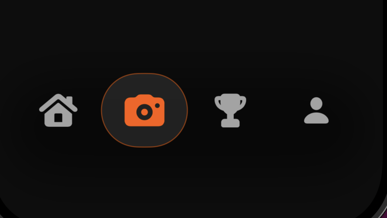

# You are working in the Spotter iOS Swift repository on the V2 design
system revamp. Before changing code:

1. Inspect the current tree end-to-end. Read:
   - README.md
   - DEBUG_LOG.md (latest entries, especially DL-045 toolchain trap)
   - Documentation/DEVELOPMENT_SETUP.md
   - Documentation/FirestoreShape.md
   - Documentation/SyncConflictResolution.md
   - Documentation/BackendQAChecklist.md
   - Documentation/firestore.rules
   - Documentation/DesignSystemV2Inventory.md (created in D0)
   - VirtualTrainer/DesignSystem/Theme.swift
   - VirtualTrainer/DesignSystem/LiquidGlass.swift
   - VirtualTrainer/DesignSystem/SpotterV2Tokens.swift   (after D1)
   - VirtualTrainer/DesignSystem/SpotterV2Typography.swift
   - VirtualTrainer/DesignSystem/SpotterV2Components.swift
   - VirtualTrainer/Services/FeatureFlags.swift
   - VirtualTrainer/Services/DesignSystemV2ToggleStore.swift  (after D1)
   - VirtualTrainer/Models/ThemeStore.swift
   - VirtualTrainer/UI/MainTabView.swift
   - The screen(s) under VirtualTrainer/UI/ being revamped in this phase
   - NEW_DESIGN/export-html/<the matching screen>.html
   - NEW_DESIGN/screenshots/<the matching screen>.png

2. Treat NEW_DESIGN HTML as visual/product reference, not production code.
   - Do NOT use WebView.
   - Do NOT embed Tailwind, iconify, Phosphor, or external fonts in this
     phase. Use SF Symbols and system fonts.
   - Translate Tailwind utilities and Phosphor icons using the rosetta
     table in Spotter_DesignV2_Forward_Plan.md Section 2.4.

3. Do NOT change MediaPipe, CameraManager, PoseEstimator, UniversalRepCounter,
   FormFeedbackEngine, HandGestureDetector, ExertionAnalyzer,
   WorkoutReadyCoordinator, FaceLandmarkerService, FramePositionAnalyzer,
   or any live camera pipeline behavior.

4. Do NOT change backend repository behavior, Firestore sync, privacy
   rules, or any backend file, unless the prompt explicitly says so.

5. Preserve both training flows (Camera tab Free Analysis AND Planned
   Workouts) and both backend modes (.local and .firebase).

6. The V2 design MUST be behind the feature flag/toggle introduced in D1.
   When the toggle is OFF or the remote flag is OFF, the app must render
   the current V1 UI unchanged. When ON, V2 renders.

7. The toggle MUST NOT reset onboarding, calibration, profile, history,
   trophies, or insights. Stores stay alive; only the SwiftUI hierarchy
   swaps.

8. Design-vs-code deltas (see Spotter_DesignV2_Forward_Plan.md Section 2.2):
   - If the design shows a feature the code does NOT support today
     (login, smart swaps, BPM trophies, KG volume trophies, calorie
     metrics, running analysis active, burpees, real account management,
     etc.) — do NOT build it. Render as disabled/coming-soon or omit.
     List every such design-only feature you encountered in this phase
     in the PR summary.
   - If the code has a feature the design does NOT show (backend status
     debug, sync diagnostics, export, delete account, free-analysis
     summary, weekly recap, insight evidence sheet, heatmap drill-in,
     calibration failed/skipped states, empty states, engagement
     controls) — STYLE IT using the V2 tokens/components/typography from
     similar design surfaces. List every such code-only feature you
     styled.

9. Do NOT hardcode raw hex colors inside feature screens. Use V2 tokens
   (SpotterV2.Tokens.*) and per-theme accent via SpotterThemeOption.

10. Do NOT assume custom fonts are bundled. Use system fonts via
    .system(size:weight:design:). The design-typography helpers in
    SpotterV2Typography.swift wrap this; use them.

11. Support iPhone SE (small) through Pro Max. Respect safe areas, Dynamic
    Type at least Large, VoiceOver labels on every interactive element,
    Reduce Motion (disable scale/opacity animations when on), Reduce
    Transparency (fall back to solid surfaces when on, especially for the
    liquid glass nav).

12. Toolchain: use the bundled Xcode toolchain (XcodeDefault.xctoolchain).
    See DEBUG_LOG DL-045. Verify with:
        xcrun --find clang
        xcrun --find swiftc
    Both must resolve under
    /Applications/Xcode.app/Contents/Developer/Toolchains/XcodeDefault.xctoolchain.

13. Builds: always use VirtualTrainer.xcworkspace, never the bare xcodeproj.
    Do not run parallel xcodebuild test commands against the same
    DerivedData path.

14. After the phase, run:
        xcodebuild build  -workspace VirtualTrainer.xcworkspace \
            -scheme VirtualTrainer \
            -destination 'platform=iOS Simulator,name=iPhone 17 Pro' \
            -derivedDataPath /tmp/VirtualTrainerDerivedData
        xcodebuild test   -workspace VirtualTrainer.xcworkspace \
            -scheme VirtualTrainer \
            -destination 'platform=iOS Simulator,name=iPhone 17 Pro' \
            -derivedDataPath /tmp/VirtualTrainerDerivedData
    Summarize PASS/FAIL counts.

15. Add SwiftUI previews for every new V2 view across the four themes
    (Hyper, Hot Girl, Warm, Spicy) and at least two device sizes
    (iPhone SE 3rd gen, iPhone 17 Pro Max). Snapshot tests where the
    project convention supports it.

16. Append a DEBUG_LOG.md entry following the existing format if the
    phase changes behavior, adds plumbing, or fixes a failure.

17. PR summary must include:
    - Changed files
    - V2 components introduced
    - V1 surfaces that remain unchanged
    - Feature-flag-off verification screenshot description
    - Feature-flag-on verification screenshot description
    - Design-only features encountered (deferred, listed)
    - Code-only features styled in V2 language (listed)
    - Known follow-ups 

18. Mention the change the code brings to the application - the before and after with real life practical examples if possible. 
19. Share an indepth end to end manual testing plan of the changes done - be practical and ensure all aspects are tested well before we proceed. 

D2 goal: replace the placeholder V2RootView with the real V2 app shell.
Build a custom liquid glass bottom tab bar that uses LiquidGlass.swift
and falls back gracefully.

TASKS

1. V2RootView.

UI/V2/V2RootView.swift
  - Mirrors the current root logic: onboarding gate → calibration gate →
    main shell.
  - When ready, shows V2MainShellView.
  - Inherits all environment objects from VirtualTrainerApp.
  - Onboarding/calibration screens in V2 ship in D3; until then, render
    the V1 onboarding/calibration but route the post-calibration tab
    container to V2MainShellView. This guarantees the user can still
    onboard with V2 toggled on.

2. V2MainShellView.

UI/V2/V2MainShellView.swift
  - Holds @State private var selectedTab: V2Tab = .dashboard.
  - Renders the selected tab's content full-screen (no SwiftUI TabView
    chrome — implement the tab switch manually so the bottom nav isn't
    constrained by TabView's default bar).
  - Uses ZStack { content; V2LiquidGlassTabBar(...).overlay alignment
    .bottom }.
  - The four tabs route to V2 stub views in this phase
    (V2DashboardPlaceholder, V2CameraPlaceholder, V2TrophiesPlaceholder,
    V2ProfilePlaceholder) that display "Coming in D4 / D6" placeholders.
    These are replaced by real V2 screens in D4–D6.

3. V2LiquidGlassTabBar.

UI/V2/V2LiquidGlassTabBar.swift
  - Floating pill: width 92% of screen, max width 440 pt, height 92 pt,
    cornerRadius 46 pt.
  - Position: 10 pt from bottom safe area inset.
  - 4 icon buttons evenly spaced:
      Dashboard: SF Symbol "house.fill"
      Camera:    SF Symbol "camera.fill"
      Trophies:  SF Symbol "trophy.fill"
      Profile:   SF Symbol "person.fill"
  - Selected tab: white/10 fill chip with primary-tint border, larger
    icon scale (1.1), accent color tint.
  - Unselected tab: muted-foreground icon color, no fill chip.
  - Tap haptic: light impact.
  - VoiceOver: each button has accessibilityLabel ("Dashboard", etc.)
    and accessibilityValue ("Selected" / "Not selected").

  Implementation strategy:
    enum V2NavStyle { case liquidGlass, solid }

    @ViewBuilder
    func navBackground(style: V2NavStyle) -> some View {
        switch style {
        case .liquidGlass:
            EmptyView()
                .frame(maxWidth: .infinity, maxHeight: .infinity)
                .glassSurface(cornerRadius: 46)  // existing LiquidGlass modifier
                .overlay(
                    RoundedRectangle(cornerRadius: 46)
                        .stroke(Color.white.opacity(0.20), lineWidth: 2)
                )
                .shadow(color: .black.opacity(0.8), radius: 25, y: 12)
        case .solid:
            RoundedRectangle(cornerRadius: 46)
                .fill(Color.black.opacity(0.85))
                .overlay(
                    RoundedRectangle(cornerRadius: 46)
                        .stroke(SpotterV2.Tokens.border, lineWidth: 2)
                )
        }
    }

    // Resolve style at runtime:
    @Environment(\.accessibilityReduceTransparency) private var reduceTransparency

    var resolvedNavStyle: V2NavStyle {
        reduceTransparency ? .solid : .liquidGlass
    }

4. Keyboard / safe area / sheet handling.

  - The nav uses .ignoresSafeArea(edges: .bottom) only for its background
    glow; the bar itself respects the safe area inset.
  - When the iOS keyboard is presented, the nav hides via
    @State private var isKeyboardVisible: Bool plus a
    NotificationCenter.publisher binding. SwiftUI's
    .interactiveDismissDisabled() and keyboardAvoidance defaults stay
    untouched on inner views.
  - When a SwiftUI .sheet or .fullScreenCover is presented, the nav
    naturally disappears because it's covered.
  - Live camera session (TrainerSessionView) is full-screen overlay;
    the nav should hide while a workout session is active. Use a shared
    AppLevelPresenterEnvironmentKey (new helper) that the camera tab
    flips when starting a session, and the nav reads from to hide.

5. DEBUG backend status chip.

In V2MainShellView, add a tiny V2BackendStatusChip pinned to the
top-right safe area, visible only in #if DEBUG and only when
BackendStatusStore.activeBackendMode != .local. Tapping it routes to
the V2 sync diagnostics screen (deferred to D6; for now, present a
sheet with the basic status text).

6. Previews + tests.

Previews:
  - iPhone SE 3rd gen
  - iPhone 17 Pro Max
  - Reduce Transparency on/off
  - Each tab selected
  - Each of the four themes

Tests:
  - V2 toggle off renders the existing MainTabView.
  - V2 toggle on renders V2MainShellView.
  - Switching toggle does not reset onboarding, profile, history.
  - reduceTransparency → solid nav style.

ACCEPTANCE
- V1 unchanged with toggle off.
- V2 shell renders with the four tabs and liquid glass nav with toggle
  on.
- Nav respects safe area, keyboard, sheets, and live workouts.
- Reduce Transparency uses solid fallback.
- Tests pass.
- DEBUG_LOG DL-### entry.
- PR summary lists which V2 tab placeholders are wired now vs deferred
  to D4–D6.

- Thread ID: 019e36e1-38f3-7cc2-a5f5-e4007f9c7ad7
- Created: 2026-05-17 22:29:50 (Asia/Kolkata)
- Updated: 2026-05-17 23:07:39 (Asia/Kolkata)
- Archived: no
- Workspace: /Users/satvik.bansal/Desktop/VirtualTrainer - mediapipe
- Source rollout: /Users/satvik.bansal/.codex/sessions/2026/05/17/rollout-2026-05-17T22-29-50-019e36e1-38f3-7cc2-a5f5-e4007f9c7ad7.jsonl
- Git branch at thread start: main
- Git SHA at thread start: df0cec9f0f8cd4ee158a8a316498f02e95eb2e96
- Exported visible messages: 35
- Extracted input images: 1

## Conversation

### User - 2026-05-17 22:29:58

You are working in the Spotter iOS Swift repository on the V2 design
system revamp. Before changing code:

1. Inspect the current tree end-to-end. Read:
   - README.md
   - DEBUG_LOG.md (latest entries, especially DL-045 toolchain trap)
   - Documentation/DEVELOPMENT_SETUP.md
   - Documentation/FirestoreShape.md
   - Documentation/SyncConflictResolution.md
   - Documentation/BackendQAChecklist.md
   - Documentation/firestore.rules
   - Documentation/DesignSystemV2Inventory.md (created in D0)
   - VirtualTrainer/DesignSystem/Theme.swift
   - VirtualTrainer/DesignSystem/LiquidGlass.swift
   - VirtualTrainer/DesignSystem/SpotterV2Tokens.swift   (after D1)
   - VirtualTrainer/DesignSystem/SpotterV2Typography.swift
   - VirtualTrainer/DesignSystem/SpotterV2Components.swift
   - VirtualTrainer/Services/FeatureFlags.swift
   - VirtualTrainer/Services/DesignSystemV2ToggleStore.swift  (after D1)
   - VirtualTrainer/Models/ThemeStore.swift
   - VirtualTrainer/UI/MainTabView.swift
   - The screen(s) under VirtualTrainer/UI/ being revamped in this phase
   - NEW_DESIGN/export-html/<the matching screen>.html
   - NEW_DESIGN/screenshots/<the matching screen>.png

2. Treat NEW_DESIGN HTML as visual/product reference, not production code.
   - Do NOT use WebView.
   - Do NOT embed Tailwind, iconify, Phosphor, or external fonts in this
     phase. Use SF Symbols and system fonts.
   - Translate Tailwind utilities and Phosphor icons using the rosetta
     table in Spotter_DesignV2_Forward_Plan.md Section 2.4.

3. Do NOT change MediaPipe, CameraManager, PoseEstimator, UniversalRepCounter,
   FormFeedbackEngine, HandGestureDetector, ExertionAnalyzer,
   WorkoutReadyCoordinator, FaceLandmarkerService, FramePositionAnalyzer,
   or any live camera pipeline behavior.

4. Do NOT change backend repository behavior, Firestore sync, privacy
   rules, or any backend file, unless the prompt explicitly says so.

5. Preserve both training flows (Camera tab Free Analysis AND Planned
   Workouts) and both backend modes (.local and .firebase).

6. The V2 design MUST be behind the feature flag/toggle introduced in D1.
   When the toggle is OFF or the remote flag is OFF, the app must render
   the current V1 UI unchanged. When ON, V2 renders.

7. The toggle MUST NOT reset onboarding, calibration, profile, history,
   trophies, or insights. Stores stay alive; only the SwiftUI hierarchy
   swaps.

8. Design-vs-code deltas (see Spotter_DesignV2_Forward_Plan.md Section 2.2):
   - If the design shows a feature the code does NOT support today
     (login, smart swaps, BPM trophies, KG volume trophies, calorie
     metrics, running analysis active, burpees, real account management,
     etc.) — do NOT build it. Render as disabled/coming-soon or omit.
     List every such design-only feature you encountered in this phase
     in the PR summary.
   - If the code has a feature the design does NOT show (backend status
     debug, sync diagnostics, export, delete account, free-analysis
     summary, weekly recap, insight evidence sheet, heatmap drill-in,
     calibration failed/skipped states, empty states, engagement
     controls) — STYLE IT using the V2 tokens/components/typography from
     similar design surfaces. List every such code-only feature you
     styled.

9. Do NOT hardcode raw hex colors inside feature screens. Use V2 tokens
   (SpotterV2.Tokens.*) and per-theme accent via SpotterThemeOption.

10. Do NOT assume custom fonts are bundled. Use system fonts via
    .system(size:weight:design:). The design-typography helpers in
    SpotterV2Typography.swift wrap this; use them.

11. Support iPhone SE (small) through Pro Max. Respect safe areas, Dynamic
    Type at least Large, VoiceOver labels on every interactive element,
    Reduce Motion (disable scale/opacity animations when on), Reduce
    Transparency (fall back to solid surfaces when on, especially for the
    liquid glass nav).

12. Toolchain: use the bundled Xcode toolchain (XcodeDefault.xctoolchain).
    See DEBUG_LOG DL-045. Verify with:
        xcrun --find clang
        xcrun --find swiftc
    Both must resolve under
    /Applications/Xcode.app/Contents/Developer/Toolchains/XcodeDefault.xctoolchain.

13. Builds: always use VirtualTrainer.xcworkspace, never the bare xcodeproj.
    Do not run parallel xcodebuild test commands against the same
    DerivedData path.

14. After the phase, run:
        xcodebuild build  -workspace VirtualTrainer.xcworkspace \
            -scheme VirtualTrainer \
            -destination 'platform=iOS Simulator,name=iPhone 17 Pro' \
            -derivedDataPath /tmp/VirtualTrainerDerivedData
        xcodebuild test   -workspace VirtualTrainer.xcworkspace \
            -scheme VirtualTrainer \
            -destination 'platform=iOS Simulator,name=iPhone 17 Pro' \
            -derivedDataPath /tmp/VirtualTrainerDerivedData
    Summarize PASS/FAIL counts.

15. Add SwiftUI previews for every new V2 view across the four themes
    (Hyper, Hot Girl, Warm, Spicy) and at least two device sizes
    (iPhone SE 3rd gen, iPhone 17 Pro Max). Snapshot tests where the
    project convention supports it.

16. Append a DEBUG_LOG.md entry following the existing format if the
    phase changes behavior, adds plumbing, or fixes a failure.

17. PR summary must include:
    - Changed files
    - V2 components introduced
    - V1 surfaces that remain unchanged
    - Feature-flag-off verification screenshot description
    - Feature-flag-on verification screenshot description
    - Design-only features encountered (deferred, listed)
    - Code-only features styled in V2 language (listed)
    - Known follow-ups 

18. Mention the change the code brings to the application - the before and after with real life practical examples if possible. 
19. Share an indepth end to end manual testing plan of the changes done - be practical and ensure all aspects are tested well before we proceed. 

D2 goal: replace the placeholder V2RootView with the real V2 app shell.
Build a custom liquid glass bottom tab bar that uses LiquidGlass.swift
and falls back gracefully.

TASKS

1. V2RootView.

UI/V2/V2RootView.swift
  - Mirrors the current root logic: onboarding gate → calibration gate →
    main shell.
  - When ready, shows V2MainShellView.
  - Inherits all environment objects from VirtualTrainerApp.
  - Onboarding/calibration screens in V2 ship in D3; until then, render
    the V1 onboarding/calibration but route the post-calibration tab
    container to V2MainShellView. This guarantees the user can still
    onboard with V2 toggled on.

2. V2MainShellView.

UI/V2/V2MainShellView.swift
  - Holds @State private var selectedTab: V2Tab = .dashboard.
  - Renders the selected tab's content full-screen (no SwiftUI TabView
    chrome — implement the tab switch manually so the bottom nav isn't
    constrained by TabView's default bar).
  - Uses ZStack { content; V2LiquidGlassTabBar(...).overlay alignment
    .bottom }.
  - The four tabs route to V2 stub views in this phase
    (V2DashboardPlaceholder, V2CameraPlaceholder, V2TrophiesPlaceholder,
    V2ProfilePlaceholder) that display "Coming in D4 / D6" placeholders.
    These are replaced by real V2 screens in D4–D6.

3. V2LiquidGlassTabBar.

UI/V2/V2LiquidGlassTabBar.swift
  - Floating pill: width 92% of screen, max width 440 pt, height 92 pt,
    cornerRadius 46 pt.
  - Position: 10 pt from bottom safe area inset.
  - 4 icon buttons evenly spaced:
      Dashboard: SF Symbol "house.fill"
      Camera:    SF Symbol "camera.fill"
      Trophies:  SF Symbol "trophy.fill"
      Profile:   SF Symbol "person.fill"
  - Selected tab: white/10 fill chip with primary-tint border, larger
    icon scale (1.1), accent color tint.
  - Unselected tab: muted-foreground icon color, no fill chip.
  - Tap haptic: light impact.
  - VoiceOver: each button has accessibilityLabel ("Dashboard", etc.)
    and accessibilityValue ("Selected" / "Not selected").

  Implementation strategy:
    enum V2NavStyle { case liquidGlass, solid }

    @ViewBuilder
    func navBackground(style: V2NavStyle) -> some View {
        switch style {
        case .liquidGlass:
            EmptyView()
                .frame(maxWidth: .infinity, maxHeight: .infinity)
                .glassSurface(cornerRadius: 46)  // existing LiquidGlass modifier
                .overlay(
                    RoundedRectangle(cornerRadius: 46)
                        .stroke(Color.white.opacity(0.20), lineWidth: 2)
                )
                .shadow(color: .black.opacity(0.8), radius: 25, y: 12)
        case .solid:
            RoundedRectangle(cornerRadius: 46)
                .fill(Color.black.opacity(0.85))
                .overlay(
                    RoundedRectangle(cornerRadius: 46)
                        .stroke(SpotterV2.Tokens.border, lineWidth: 2)
                )
        }
    }

    // Resolve style at runtime:
    @Environment(\.accessibilityReduceTransparency) private var reduceTransparency

    var resolvedNavStyle: V2NavStyle {
        reduceTransparency ? .solid : .liquidGlass
    }

4. Keyboard / safe area / sheet handling.

  - The nav uses .ignoresSafeArea(edges: .bottom) only for its background
    glow; the bar itself respects the safe area inset.
  - When the iOS keyboard is presented, the nav hides via
    @State private var isKeyboardVisible: Bool plus a
    NotificationCenter.publisher binding. SwiftUI's
    .interactiveDismissDisabled() and keyboardAvoidance defaults stay
    untouched on inner views.
  - When a SwiftUI .sheet or .fullScreenCover is presented, the nav
    naturally disappears because it's covered.
  - Live camera session (TrainerSessionView) is full-screen overlay;
    the nav should hide while a workout session is active. Use a shared
    AppLevelPresenterEnvironmentKey (new helper) that the camera tab
    flips when starting a session, and the nav reads from to hide.

5. DEBUG backend status chip.

In V2MainShellView, add a tiny V2BackendStatusChip pinned to the
top-right safe area, visible only in #if DEBUG and only when
BackendStatusStore.activeBackendMode != .local. Tapping it routes to
the V2 sync diagnostics screen (deferred to D6; for now, present a
sheet with the basic status text).

6. Previews + tests.

Previews:
  - iPhone SE 3rd gen
  - iPhone 17 Pro Max
  - Reduce Transparency on/off
  - Each tab selected
  - Each of the four themes

Tests:
  - V2 toggle off renders the existing MainTabView.
  - V2 toggle on renders V2MainShellView.
  - Switching toggle does not reset onboarding, profile, history.
  - reduceTransparency → solid nav style.

ACCEPTANCE
- V1 unchanged with toggle off.
- V2 shell renders with the four tabs and liquid glass nav with toggle
  on.
- Nav respects safe area, keyboard, sheets, and live workouts.
- Reduce Transparency uses solid fallback.
- Tests pass.
- DEBUG_LOG DL-### entry.
- PR summary lists which V2 tab placeholders are wired now vs deferred
  to D4–D6.

### Assistant - 2026-05-17 22:30:04

I’ll map the repo and read the requested docs/code first, including the D1 toggle pieces and the design reference files. Then I’ll make the V2 shell change behind the flag and run the exact workspace build/test commands with the XcodeDefault toolchain.

### Assistant - 2026-05-17 22:30:21

The toolchain check already resolves to `XcodeDefault.xctoolchain`, so DL-045’s trap is covered. I’m reading the requested docs and the existing app/root/toggle code now, with an eye toward where the V2 shell should hook in without touching camera or backend behavior.

### Assistant - 2026-05-17 22:30:51

A few constraints are already clear: D2 maps specifically to `liquid-glass-nav-iteration`, and this phase should only wire the shell plus stubs. The design has dashboard sample content, but I’m going to keep those as placeholders and avoid pretending the D4/D6 data screens exist yet.

### Assistant - 2026-05-17 22:35:05

I’ve got enough context to cut the implementation now. The edits will be narrowly scoped: add the app-level presentation binding, replace the D1 root placeholder with the gated V2 shell, add the custom glass tab bar and stub tab surfaces, then add tests around routing/toggle preservation/nav fallback.

### Assistant - 2026-05-17 22:39:09

The root placeholder is now replaced with a gated shell: V2 still shows V1 onboarding/calibration until D3, then drops into a manual four-tab V2 shell. I also added a small app-level presentation binding so session starts can hide the custom nav without changing the live camera stack.

### Assistant - 2026-05-17 22:39:48

The first build caught Swift compile errors in the new V2 files, but the Xcode log truncated the actual diagnostics. I’m rerunning the same build filtered for compiler errors so I can fix the exact lines instead of guessing.

### Assistant - 2026-05-17 22:41:53

The V2 compile issues are fixed now; the second build succeeds under the bundled Xcode toolchain. I’m rerunning the exact required build command cleanly, then I’ll run the full required test command on the same DerivedData path, sequentially.

### Assistant - 2026-05-17 22:43:20

I’ve got the D2 shell mostly wired and I’m in the verification stretch now. The exact workspace build is running under the XcodeDefault toolchain; once that finishes I’ll run the required test command against the same DerivedData path, then append the debug-log entry with the real results.

### Assistant - 2026-05-17 22:43:24

Build passed cleanly enough to move forward: the app compiled through the workspace on iPhone 17 Pro using the required DerivedData path. I’m starting the matching `xcodebuild test` now, single-threaded against that same path so we don’t trip over the build products.

### Assistant - 2026-05-17 22:43:49

The test run found a compile-time issue in the new tests, not an app build failure: `XCTAssertTrue` autoclosures can’t directly contain `await`. I’m making that small test-only correction now, then I’ll rerun the exact test command.

### Assistant - 2026-05-17 22:43:52

The test fix is deliberately tiny: evaluate the async store mutations into local booleans first, then assert those values. That keeps the store-preservation coverage intact without fighting XCTest’s autoclosure rules.

### Assistant - 2026-05-17 22:43:57

That compile issue is patched. I’m rerunning the required full test command now and will use this second run for the final PASS/FAIL counts.

### Assistant - 2026-05-17 22:44:34

The test target now compiles and the runner has moved past build/signing into execution. I’m waiting for the simulator-side results; this is the part that tells us whether the new routing/store/nav assertions hold in practice.

### Assistant - 2026-05-17 22:45:38

The full test suite passed on the rerun. I’m pulling the structured result summary from the `.xcresult` now so the final count is based on Xcode’s record rather than a hand count from the console stream.

### Assistant - 2026-05-17 22:46:10

The verification sweep is green too: `git diff --check` passed, and the static scan found no WebView/Tailwind/Iconify/Phosphor/raw-hex hits in the new V2 app surfaces. I’m appending the D2 debug-log entry now with the exact 444 passed / 0 failed / 4 skipped test result.

### Assistant - 2026-05-17 22:48:41

Implemented D2: the V2 toggle now routes into a real V2 app shell instead of the old placeholder root.

**PR Summary**
- Changed files: [V2RootView.swift](/Users/satvik.bansal/Desktop/VirtualTrainer%20-%20mediapipe/VirtualTrainer/UI/V2/V2RootView.swift), [V2MainShellView.swift](/Users/satvik.bansal/Desktop/VirtualTrainer%20-%20mediapipe/VirtualTrainer/UI/V2/V2MainShellView.swift), [V2LiquidGlassTabBar.swift](/Users/satvik.bansal/Desktop/VirtualTrainer%20-%20mediapipe/VirtualTrainer/UI/V2/V2LiquidGlassTabBar.swift), [AppRootRouting.swift](/Users/satvik.bansal/Desktop/VirtualTrainer%20-%20mediapipe/VirtualTrainer/Models/AppRootRouting.swift), [AppLevelPresenter.swift](/Users/satvik.bansal/Desktop/VirtualTrainer%20-%20mediapipe/VirtualTrainer/Models/AppLevelPresenter.swift), [VirtualTrainerApp.swift](/Users/satvik.bansal/Desktop/VirtualTrainer%20-%20mediapipe/VirtualTrainer/VirtualTrainerApp.swift), [CameraTabView.swift](/Users/satvik.bansal/Desktop/VirtualTrainer%20-%20mediapipe/VirtualTrainer/UI/CameraTabView.swift), [PlannedWorkoutSessionView.swift](/Users/satvik.bansal/Desktop/VirtualTrainer%20-%20mediapipe/VirtualTrainer/UI/PlannedWorkoutSessionView.swift), [DesignSystemV2Tests.swift](/Users/satvik.bansal/Desktop/VirtualTrainer%20-%20mediapipe/VirtualTrainerTests/DesignSystemV2Tests.swift), [DEBUG_LOG.md](/Users/satvik.bansal/Desktop/VirtualTrainer%20-%20mediapipe/DEBUG_LOG.md). Removed the old placeholder `VirtualTrainer/UI/V2RootView.swift`.
- V2 components introduced: `V2RootView`, `V2MainShellView`, `V2LiquidGlassTabBar`, `V2Tab`, `V2NavStyle`, D2 tab placeholders, DEBUG `V2BackendStatusSheet`, app-level presenter environment state.
- Wired now: Dashboard, Camera, Trophies, Profile V2 tabs as D2 placeholders. Deferred: real Dashboard/Camera in D4, Trophies/Profile/sync diagnostics in D6.
- V1 surfaces unchanged: V1 onboarding, V1 calibration, existing `MainTabView`, existing V1 Dashboard/Camera/Trophies/Profile when V2 is off.
- Feature-flag-off screenshot description: existing V1 app shell with the current SwiftUI `TabView` chrome and no liquid-glass nav.
- Feature-flag-on screenshot description: V2 dark placeholder screen with a floating liquid-glass bottom pill, four SF Symbol tabs, selected chip, and theme-tinted icon.
- Design-only features deferred: remote avatar, “Hello, Satvik”, training-active status, “Squat Depth: +2cm”, sample 94% form score, 14-day consistency, and Phosphor/Iconify/font references from the nav HTML.
- Code-only features styled in V2 language: DEBUG backend status chip/basic diagnostics sheet and DEBUG “Return to V1” escape path in the V2 Profile placeholder.
- Known follow-ups: D3 V2 onboarding/calibration, D4 real Dashboard/Camera, D6 Trophies/Profile/sync diagnostics, and real-device visual QA for liquid glass.

**Before / After**
Before: forcing V2 on dropped the app into a placeholder root. A new user could lose the practical onboarding path, and a developer could not inspect real app navigation.

After: V2 on still lets a new user complete the existing onboarding/calibration, then lands in the V2 shell. Example: a developer can flip V2 on, see the glass tab bar, tap through D2 placeholders, and still flip back to V1 without losing profile/history/theme data.

**Verification**
- Toolchain: `clang` and `swiftc` both resolve under `XcodeDefault.xctoolchain`.
- Build: PASS.
- Tests: PASS, 444 passed / 0 failed / 4 skipped.
- `git diff --check`: PASS.
- Static scan: no WebView, Tailwind, Iconify, Phosphor, or feature-screen raw hex in the new V2 shell surfaces.

**Manual Test Plan**
1. Toggle V2 off, launch fresh, confirm V1 onboarding, calibration, and main tabs look unchanged.
2. Toggle V2 on before onboarding; complete V1 onboarding and calibration; confirm the post-calibration destination is the V2 shell.
3. In V2 shell, tap all four tabs; confirm correct labels, selected chip, haptics, and VoiceOver label/value.
4. Test Hyper, Hot Girl, Warm, and Spicy themes; confirm selected nav tint changes per theme.
5. On iPhone SE and Pro Max, confirm the pill stays within safe area, maxes at 440 pt, and does not clip text.
6. Enable Reduce Transparency; confirm solid black nav fallback. Enable Reduce Motion; confirm press/transition motion is subdued.
7. In DEBUG firebase mode, tap the backend chip; confirm the basic diagnostics sheet appears.
8. Start Free Analysis and Planned Workout in V1 mode; confirm camera/session behavior remains unchanged.
9. During live sessions, confirm full-screen workout presentation is not visually fighting global nav.
10. Toggle V2 on/off repeatedly after creating profile/history/theme data; confirm stores persist.

### User - 2026-05-17 22:56:27

Enable Reduce Transparency; confirm solid black nav fallback. Enable Reduce Motion; confirm press/transition motion is subdued. 

how do i do this? i cannot find this button

### Assistant - 2026-05-17 22:57:13

It isn’t a Spotter button. It’s an iOS Accessibility setting.

On a real iPhone:

1. Open **Settings**
2. Go to **Accessibility**
3. For transparency:
   - **Display & Text Size**
   - Turn on **Reduce Transparency**
4. For motion:
   - Go back to **Accessibility**
   - Tap **Motion**
   - Turn on **Reduce Motion**

In the iOS Simulator:

1. Press `Cmd + Shift + H` to go Home
2. Open the **Settings** app in the simulator
3. Follow the same paths:
   - **Accessibility → Display & Text Size → Reduce Transparency**
   - **Accessibility → Motion → Reduce Motion**

What you should see in Spotter V2:

- **Reduce Transparency ON**: the bottom nav should stop looking glassy/blurred and become a solid black pill with a border.
- **Reduce Motion ON**: tab taps should still work, but the press/selection/nav hide-show animations should feel much more subdued.

### User - 2026-05-17 22:59:07

# Files mentioned by the user:

## Screenshot 2026-05-17 at 10.58.09 PM.png: /var/folders/75/nndfzddd11b8kv28kpwdjlh40000gp/T/TemporaryItems/NSIRD_screencaptureui_rXgXQq/Screenshot 2026-05-17 at 10.58.09 PM.png

## My request for Codex:
attached is a screenshot of how the Nav looks in the V2 design. It is not liquid glass in the least. not floating either like in the actual design files. can you deeply review this? is this at par with the original prompt or did you miss somethign? 

<image name=[Image #1]>

</image>

### Assistant - 2026-05-17 22:59:31

I’m going to treat this as a real design QA miss and re-open the implementation against the actual nav reference, not just eyeball the screenshot. I’ll compare the prompt, the HTML/screenshot reference, and the SwiftUI surface so we can separate “expected because placeholder content is flat” from “I under-shot the glass/floating treatment.”

### Assistant - 2026-05-17 23:00:24

I found two separate things already. First, if Reduce Transparency is currently enabled, the solid black pill is literally the expected fallback path. Second, even with transparency enabled, the D2 implementation is visually underpowered against the design reference because the current placeholder surface is too flat and the nav relies heavily on the compatibility `glassSurface` behavior.

### Assistant - 2026-05-17 23:01:24

I’m going to patch the nav, because the review found a real miss: the implementation followed the prompt’s structural API, but it did not carry enough of the actual `bg-black/40 + backdrop blur + rim highlight` treatment from the HTML reference, and the extra black glow made the pill read heavier than it should.

### User - 2026-05-17 23:01:33

the v1 bottom nav currenrly is really good. take insipiration from that and fit it into the design theme of v2?

### Assistant - 2026-05-17 23:01:45

Got it. I’ll pivot the fix toward the V1 bar’s strengths instead of trying to force a web mockup literally: keep the clean, readable iOS tab ergonomics, then dress it in V2 glass/tokens so it still feels like the new system.

### Assistant - 2026-05-17 23:02:16

The V1 bar’s useful parts are the grid/profile symbols, visible labels, balanced icon size, and a selected tint that doesn’t make the whole control feel oversized. I’m bringing those into the V2 bar while keeping the floating glass pill, theme tint, Reduce Transparency fallback, haptics, and accessibility behavior.

### Assistant - 2026-05-17 23:02:57

The nav patch is compiling now. I’m using the same workspace/simulator/DerivedData path as the D2 verification so we catch actual SwiftUI/Xcode issues, not just a local syntax check.

### Assistant - 2026-05-17 23:03:12

The build passed after the V1-inspired nav changes. I’m running the V2 test slice now, because this area has route, store-preservation, reduce-transparency, and snapshot smoke coverage already.

### Assistant - 2026-05-17 23:05:00

The V2 test slice passed: 13 passed, 0 failed. I’m recording this as a D2 visual QA follow-up in the debug log because it corrects behavior/visual treatment after your screenshot review.

### Assistant - 2026-05-17 23:05:36

You were right. The first D2 nav was functional, but visually it was not at par: it leaned too hard on a dark glass fallback, the glow made it feel like a heavy slab, and it lost the very good V1 affordance of labeled, familiar tabs.

I updated [V2LiquidGlassTabBar.swift](</Users/satvik.bansal/Desktop/VirtualTrainer - mediapipe/VirtualTrainer/UI/V2/V2LiquidGlassTabBar.swift>) to take inspiration from V1:
- Dashboard now uses `square.grid.2x2.fill`.
- Profile now uses `person.crop.circle.fill`.
- Each tab has a compact visible label like V1.
- Selected state is softer: less aggressive border, smaller balanced icon, theme tint retained.
- Glass surface now layers `.glassSurface` behind black/40 tint, border, and a subtle rim highlight.
- Shadow/glow is reduced so it reads more like a floating pill.
- VoiceOver selected trait is added.

Also appended [DEBUG_LOG.md](</Users/satvik.bansal/Desktop/VirtualTrainer - mediapipe/DEBUG_LOG.md>) entry `DL-075`.

One important note: when **Reduce Transparency** is enabled, the nav is expected to become solid black. That is the accessibility fallback. To judge the liquid/glass version, turn Reduce Transparency off.

Verification after this visual patch:
- Build: PASS
- `DesignSystemV2Tests`: 13 passed / 0 failed / 0 skipped
- `git diff --check`: PASS
- Static scan: no WebView, Tailwind, Iconify, Phosphor, or raw hex added in the V2 nav.

### User - 2026-05-17 23:05:36

log the above in debug log. we dont want to repeat this miss while revamping the design of other more important screens! also do an audit of the fonts, colours, elements, etc that have been added till current scope with the originals to ensure we are on the right track as per scopes degined in D0, D1 and current D2.

### Assistant - 2026-05-17 23:05:56

Absolutely. I’m going to turn this into a concrete prevention note, then audit what we’ve actually introduced in D0/D1/D2 against the design references and the scope guardrails: fonts, color usage, icon choices, component shapes, accessibility fallbacks, and unsupported design features.

### Assistant - 2026-05-17 23:06:19

The initial audit confirms the foundation is broadly pointed in the right direction: D1 tokens mirror the D0 extracted palette, typography is system-only, and the V2 shell uses tokens/SF Symbols rather than web assets. I’m running static checks now for the exact failure modes we want to avoid repeating: custom fonts, raw feature-screen colors, web/icon libraries, and D0/D1/D2 scope drift.

### Assistant - 2026-05-17 23:06:47

The audit surfaced one useful nuance: the nav now intentionally departs from the D2 prompt’s exact icon-only spec because you asked to preserve the stronger V1 navigation affordance. I’m logging that as an approved visual correction, not as a hidden deviation, so future phases don’t blindly sacrifice usability to the HTML.

### Assistant - 2026-05-17 23:07:38

Logged it in [DEBUG_LOG.md](</Users/satvik.bansal/Desktop/VirtualTrainer - mediapipe/DEBUG_LOG.md>) as `DL-076`, building on the `DL-075` nav visual QA entry.

Audit result: we are broadly on track for D0-D2, with one important process correction.

- **Fonts:** OK. No custom/external fonts in Swift. `SpotterV2Typography` uses system fonts only.
- **Colors:** OK. Raw hex exists only in `SpotterV2Tokens.swift`, matching the D0 extracted palette. Feature surfaces are using tokens/theme accents.
- **Icons/assets:** OK. No WebView, Tailwind, Iconify, Phosphor, or `ph:` references in Swift. SF Symbols are used.
- **Components:** OK. D1 introduced the expected V2 primitives, and D2 stayed scoped to root/shell/nav.
- **Scope discipline:** OK. D2 did not fake unsupported dashboard metrics, avatar, calories, running analysis, login, smart swaps, HR/MET/BPM/KG trophies, etc.
- **Nav:** corrected and explicitly logged. It now intentionally borrows V1’s stronger affordances while keeping V2 glass/tint language.

The big prevention item now in the log: every remaining V2 phase must compare the SwiftUI result against both the `NEW_DESIGN` screenshot and the current V1 surface before being called done. That is the thing we missed here.

Verification run for the audit:
- Custom font scan: no matches.
- Web/Iconify/Phosphor/Tailwind scan: no matches.
- Raw hex scan: only `SpotterV2Tokens.swift`.
- `git diff --check`: PASS.

I did not rerun the full app test suite after this log-only audit append; the previous nav code patch already had build PASS and `DesignSystemV2Tests` PASS.
